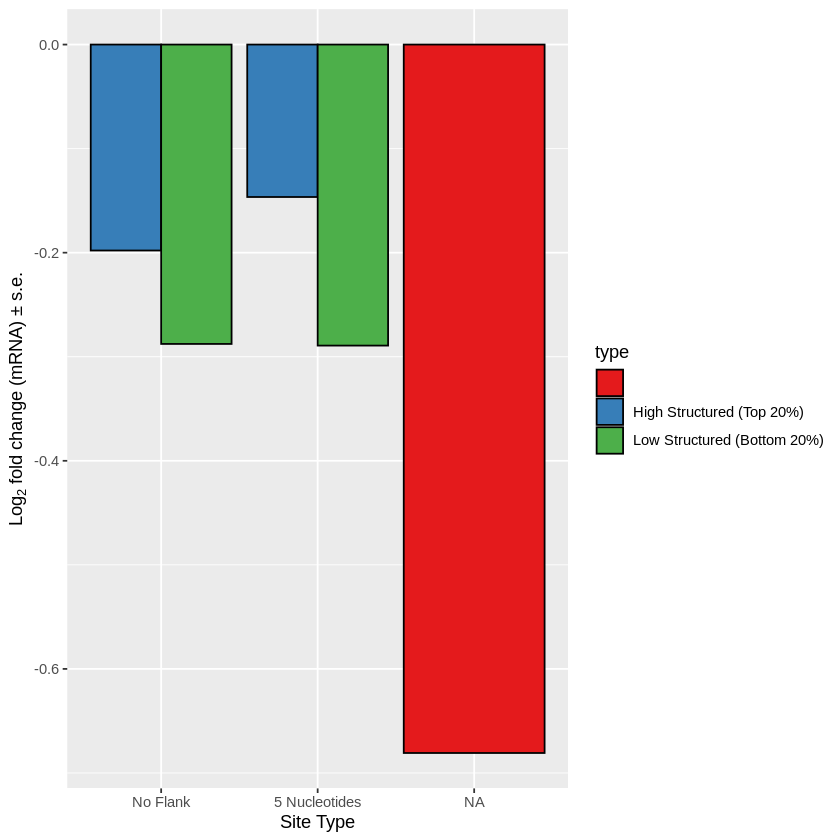

```R
library(ggplot2)
```


```R
library(dplyr)
```

    Warning message:
    “package ‘dplyr’ was built under R version 3.6.3”
    
    Attaching package: ‘dplyr’
    
    
    The following objects are masked from ‘package:stats’:
    
        filter, lag
    
    
    The following objects are masked from ‘package:base’:
    
        intersect, setdiff, setequal, union
    
    


```R
avr <- read.csv('targets.csv')
```


```R
ggplot(avr, aes(b, colour = type)) + stat_ecdf(geom = "step") + xlim(-1, 1) + xlab(expression('Log'[2]*' fold change (mRNA)')) + ylab("Cumulative Proportion") + labs(color='Target Type') 
```

    Warning message:
    “Removed 31835 rows containing non-finite values (stat_ecdf).”


    

    


```R
eightmer <- avr[avr$type=="8mer",]
sevenmera1 <- avr[avr$type=="7mera1",]
sevenmerm8 <- avr[avr$type=="7merm8",]
sixmer <- avr[avr$type=="6mer",]
nontarget <- avr[avr$type=="non-targets",]
print(nrow(eightmer) / 25)
print(nrow(sevenmera1) / 25)
print(nrow(sevenmerm8) / 25)
print(nrow(sixmer) / 25)
print(nrow(nontarget ) / 25)
avr_counts <- c(nrow(eightmer) / 25, nrow(sevenmera1) / 25, nrow(sevenmerm8) / 25, nrow(sixmer) / 25, nrow(nontarget ) / 25)
groups <- c('8mer', '7mera1', '7merm8', '6mer', 'non-targets')
avr_count_seed_types <- data.frame(avr_counts, groups)
print(ks.ts <- ks.test(eightmer[,"b"], nontarget[,"b"], alternative = "two.sided"))
print(ks.ts <- ks.test(sevenmera1[,"b"], nontarget[,"b"], alternative = "two.sided"))
print(ks.ts <- ks.test(sevenmerm8[,"b"], nontarget[,"b"], alternative = "two.sided"))
print(ks.ts <- ks.test(sixmer[,"b"], nontarget[,"b"], alternative = "two.sided"))
print(anno <- t.test(eightmer[,"b"], nontarget[,"b"]))
print(anno <- t.test(sevenmera1[,"b"], nontarget[,"b"]))
print(anno <- t.test(sevenmerm8[,"b"], nontarget[,"b"]))
print(anno <- t.test(sixmer[,"b"], nontarget[,"b"]))
print(anno <- t.test(sixmer[,"b"], nontarget[,"b"]))
```

    [1] 751.44
    [1] 1083.6
    [1] 1466.08
    [1] 2373.88
    [1] 13258.12


    Warning message in ks.test(eightmer[, "b"], nontarget[, "b"], alternative = "two.sided"):
    “p-value will be approximate in the presence of ties”


    
    	Two-sample Kolmogorov-Smirnov test
    
    data:  eightmer[, "b"] and nontarget[, "b"]
    D = 0.14308, p-value < 2.2e-16
    alternative hypothesis: two-sided
    


    Warning message in ks.test(sevenmera1[, "b"], nontarget[, "b"], alternative = "two.sided"):
    “p-value will be approximate in the presence of ties”


    
    	Two-sample Kolmogorov-Smirnov test
    
    data:  sevenmera1[, "b"] and nontarget[, "b"]
    D = 0.080943, p-value < 2.2e-16
    alternative hypothesis: two-sided
    


    Warning message in ks.test(sevenmerm8[, "b"], nontarget[, "b"], alternative = "two.sided"):
    “p-value will be approximate in the presence of ties”


    
    	Two-sample Kolmogorov-Smirnov test
    
    data:  sevenmerm8[, "b"] and nontarget[, "b"]
    D = 0.07117, p-value < 2.2e-16
    alternative hypothesis: two-sided
    


    Warning message in ks.test(sixmer[, "b"], nontarget[, "b"], alternative = "two.sided"):
    “p-value will be approximate in the presence of ties”


    
    	Two-sample Kolmogorov-Smirnov test
    
    data:  sixmer[, "b"] and nontarget[, "b"]
    D = 0.04097, p-value < 2.2e-16
    alternative hypothesis: two-sided
    
    
    	Welch Two Sample t-test
    
    data:  eightmer[, "b"] and nontarget[, "b"]
    t = -40.313, df = 22052, p-value < 2.2e-16
    alternative hypothesis: true difference in means is not equal to 0
    95 percent confidence interval:
     -0.1642050 -0.1489776
    sample estimates:
      mean of x   mean of y 
    -0.13113204  0.02545925 
    
    
    	Welch Two Sample t-test
    
    data:  sevenmera1[, "b"] and nontarget[, "b"]
    t = -22.179, df = 34809, p-value < 2.2e-16
    alternative hypothesis: true difference in means is not equal to 0
    95 percent confidence interval:
     -0.07570050 -0.06340734
    sample estimates:
      mean of x   mean of y 
    -0.04409467  0.02545925 
    
    
    	Welch Two Sample t-test
    
    data:  sevenmerm8[, "b"] and nontarget[, "b"]
    t = -21.8, df = 49849, p-value < 2.2e-16
    alternative hypothesis: true difference in means is not equal to 0
    95 percent confidence interval:
     -0.06761796 -0.05646217
    sample estimates:
      mean of x   mean of y 
    -0.03658082  0.02545925 
    
    
    	Welch Two Sample t-test
    
    data:  sixmer[, "b"] and nontarget[, "b"]
    t = -7.3205, df = 96480, p-value = 2.489e-13
    alternative hypothesis: true difference in means is not equal to 0
    95 percent confidence interval:
     -0.02129467 -0.01230008
    sample estimates:
      mean of x   mean of y 
    0.008661875 0.025459247 
    
    
    	Welch Two Sample t-test
    
    data:  sixmer[, "b"] and nontarget[, "b"]
    t = -7.3205, df = 96480, p-value = 2.489e-13
    alternative hypothesis: true difference in means is not equal to 0
    95 percent confidence interval:
     -0.02129467 -0.01230008
    sample estimates:
      mean of x   mean of y 
    0.008661875 0.025459247 
    


```R
summary <- avr %>% # the names of the new data frame and the data frame to be summarised
  group_by(type) %>%   # the grouping variable
summarise(mean = mean(b),  # calculates the mean of each group
            sd = sd(b), # calculates the standard deviation of each group
            n = n(),  # calculates the sample size per group
            SE = sd(b)/sqrt(n())) # calculates the standard error of each group
```


```R
ggplot(summary, aes(x = reorder(type, -mean), y = mean)) + 
                   geom_col() + geom_bar(stat="identity", color="black", fill ="darkslategray3") + 
                   geom_errorbar(aes(ymin = mean - SE, ymax = mean + SE), width=0.2) + labs(y=expression('Log'[2]*' fold change (mRNA) ± s.e.'), x = "Site Type") + theme_classic() + geom_text(aes(label=round(mean, digits = 3)), position=position_dodge(width=0.9), vjust=2.6)

```


    

    


```R
ggsave(myplot, file=paste0("avr_bar.png"))
```

    Saving 6.67 x 6.67 in image
    


```R
shape_avr <- read.csv('combined_shape_all.csv')
```


```R
ggplot(shape_avr, aes(b, colour = type)) + stat_ecdf(geom = "step") + xlim(-1, 1) + xlab(expression('Log'[2]*' fold change (mRNA)')) + ylab("Cumulative Proportion") + labs(color='Target Type') 
```

    Warning message:
    “Removed 50048 rows containing non-finite values (stat_ecdf).”


    

    


```R
ggsave(myplot, file=paste("avr_shape_ecdf.png"))
```

    Saving 6.67 x 6.67 in image
    
    Warning message:
    “Removed 50048 rows containing non-finite values (stat_ecdf).”


```R
high <- shape_avr[shape_avr$type=="High Structured (Top 20%)",]
low <- shape_avr[shape_avr$type=="Low Structured (Bottom 20%)",]
nontarget <- shape_avr[shape_avr$type=="non-targets",]
avr_counts <- c(nrow(high) / 25, nrow(low) / 25, nrow(nontarget) / 25)
groups <- c('High Structured', 'Low Structured ','non-targets')
avr_count_seed_types <- data.frame(avr_counts, groups)
print(ks.ts <- ks.test(high[,"b"], nontarget[,"b"], alternative = "two.sided"))
print(ks.ts <- ks.test(low[,"b"], nontarget[,"b"], alternative = "two.sided"))
print(ks.ts <- ks.test(high[,"b"], low[,"b"], alternative = "two.sided"))
print(anno <- t.test(high[,"b"], nontarget[,"b"]))
print(anno <- t.test(low[,"b"], nontarget[,"b"]))
print(anno <- t.test(high[,"b"], low[,"b"]))
```

    Warning message in ks.test(high[, "b"], nontarget[, "b"], alternative = "two.sided"):
    “p-value will be approximate in the presence of ties”


    
    	Two-sample Kolmogorov-Smirnov test
    
    data:  high[, "b"] and nontarget[, "b"]
    D = 0.12921, p-value < 2.2e-16
    alternative hypothesis: two-sided
    


    Warning message in ks.test(low[, "b"], nontarget[, "b"], alternative = "two.sided"):
    “p-value will be approximate in the presence of ties”


    
    	Two-sample Kolmogorov-Smirnov test
    
    data:  low[, "b"] and nontarget[, "b"]
    D = 0.16538, p-value < 2.2e-16
    alternative hypothesis: two-sided
    


    Warning message in ks.test(high[, "b"], low[, "b"], alternative = "two.sided"):
    “p-value will be approximate in the presence of ties”


    
    	Two-sample Kolmogorov-Smirnov test
    
    data:  high[, "b"] and low[, "b"]
    D = 0.064671, p-value = 0.0003562
    alternative hypothesis: two-sided
    
    
    	Welch Two Sample t-test
    
    data:  high[, "b"] and nontarget[, "b"]
    t = -8.26, df = 2141.2, p-value = 2.519e-16
    alternative hypothesis: true difference in means is not equal to 0
    95 percent confidence interval:
     -0.3174376 -0.1956269
    sample estimates:
      mean of x   mean of y 
    -0.19791316  0.05861907 
    
    
    	Welch Two Sample t-test
    
    data:  low[, "b"] and nontarget[, "b"]
    t = -10.5, df = 2083.1, p-value < 2.2e-16
    alternative hypothesis: true difference in means is not equal to 0
    95 percent confidence interval:
     -0.4109965 -0.2816355
    sample estimates:
      mean of x   mean of y 
    -0.28769689  0.05861907 
    
    
    	Welch Two Sample t-test
    
    data:  high[, "b"] and low[, "b"]
    t = 1.9934, df = 4105.1, p-value = 0.04628
    alternative hypothesis: true difference in means is not equal to 0
    95 percent confidence interval:
     0.001479434 0.178088009
    sample estimates:
     mean of x  mean of y 
    -0.1979132 -0.2876969 
    


```R
summary <- shape_avr %>% # the names of the new data frame and the data frame to be summarised
  group_by(type) %>%   # the grouping variable
summarise(mean = mean(b),  # calculates the mean of each group
            sd = sd(b), # calculates the standard deviation of each group
            n = n(),  # calculates the sample size per group
            SE = sd(b)/sqrt(n())) # calculates the standard error of each group
```


```R
ggplot(summary, aes(x = reorder(type, -mean), y = mean)) + 
                   geom_col() + geom_bar(stat="identity", color="black", fill ="darkslategray3") + 
                   geom_errorbar(aes(ymin = mean - SE, ymax = mean + SE), width=0.2) + labs(y=expression('Log'[2]*' fold change (mRNA) ± s.e.'), x = "Site Type") + theme_classic() + geom_text(aes(label=round(mean, digits = 3)), position=position_dodge(width=0.9), vjust=6.5)

```


    

    


```R
ggsave(myplot, file=paste("avr_shape_bar.png"))
```

    Saving 6.67 x 6.67 in image
    


```R
shape_avr_flank <- read.csv('combined_shape_flank_all_5.csv')
```


```R
ggplot(shape_avr_flank, aes(b, colour = type)) + stat_ecdf(geom = "step") + xlim(-1, 1) + xlab(expression('Log'[2]*' fold change (mRNA)')) + ylab("Cumulative Proportion") + labs(color='Target Type') 
```

    Warning message:
    “Removed 50048 rows containing non-finite values (stat_ecdf).”


    

    


```R
ggsave(myplot, file=paste("avr_shape_flank_ecdf_5.png"))
```

    Saving 6.67 x 6.67 in image
    
    Warning message:
    “Removed 50048 rows containing non-finite values (stat_ecdf).”


```R
high <- shape_avr_flank[shape_avr_flank$type=="High Structured (Top 20%)",]
low <- shape_avr_flank[shape_avr_flank$type=="Low Structured (Bottom 20%)",]
nontarget <- shape_avr_flank[shape_avr_flank$type=="non-targets",]
avr_counts <- c(nrow(high) / 25, nrow(low) / 25, nrow(nontarget) / 25)
groups <- c('High Structured', 'Low Structured ','non-targets')
avr_count_seed_types <- data.frame(avr_counts, groups)
print(ks.ts <- ks.test(high[,"b"], nontarget[,"b"], alternative = "two.sided"))
print(ks.ts <- ks.test(low[,"b"], nontarget[,"b"], alternative = "two.sided"))
print(ks.ts <- ks.test(high[,"b"], low[,"b"], alternative = "two.sided"))
print(anno <- t.test(high[,"b"], nontarget[,"b"]))
print(anno <- t.test(low[,"b"], nontarget[,"b"]))
print(anno <- t.test(high[,"b"], low[,"b"]))
```

    Warning message in ks.test(high[, "b"], nontarget[, "b"], alternative = "two.sided"):
    “p-value will be approximate in the presence of ties”


    
    	Two-sample Kolmogorov-Smirnov test
    
    data:  high[, "b"] and nontarget[, "b"]
    D = 0.12703, p-value < 2.2e-16
    alternative hypothesis: two-sided
    


    Warning message in ks.test(low[, "b"], nontarget[, "b"], alternative = "two.sided"):
    “p-value will be approximate in the presence of ties”


    
    	Two-sample Kolmogorov-Smirnov test
    
    data:  low[, "b"] and nontarget[, "b"]
    D = 0.15749, p-value < 2.2e-16
    alternative hypothesis: two-sided
    


    Warning message in ks.test(high[, "b"], low[, "b"], alternative = "two.sided"):
    “p-value will be approximate in the presence of ties”


    
    	Two-sample Kolmogorov-Smirnov test
    
    data:  high[, "b"] and low[, "b"]
    D = 0.058622, p-value = 0.002664
    alternative hypothesis: two-sided
    
    
    	Welch Two Sample t-test
    
    data:  high[, "b"] and nontarget[, "b"]
    t = -7.1723, df = 1996, p-value = 1.035e-12
    alternative hypothesis: true difference in means is not equal to 0
    95 percent confidence interval:
     -0.2916135 -0.1663816
    sample estimates:
      mean of x   mean of y 
    -0.17111453  0.05788301 
    
    
    	Welch Two Sample t-test
    
    data:  low[, "b"] and nontarget[, "b"]
    t = -10.229, df = 1943.1, p-value < 2.2e-16
    alternative hypothesis: true difference in means is not equal to 0
    95 percent confidence interval:
     -0.4062823 -0.2755516
    sample estimates:
      mean of x   mean of y 
    -0.28303392  0.05788301 
    
    
    	Welch Two Sample t-test
    
    data:  high[, "b"] and low[, "b"]
    t = 2.4384, df = 3840, p-value = 0.0148
    alternative hypothesis: true difference in means is not equal to 0
    95 percent confidence interval:
     0.02193289 0.20190588
    sample estimates:
     mean of x  mean of y 
    -0.1711145 -0.2830339 
    


```R
summary <- shape_avr_flank %>% # the names of the new data frame and the data frame to be summarised
  group_by(type) %>%   # the grouping variable
summarise(mean = mean(b),  # calculates the mean of each group
            sd = sd(b), # calculates the standard deviation of each group
            n = n(),  # calculates the sample size per group
            SE = sd(b)/sqrt(n())) # calculates the standard error of each group
```


```R
ggplot(summary, aes(x = reorder(type, -mean), y = mean)) + 
                   geom_col() + geom_bar(stat="identity", color="black", fill ="darkslategray3") + 
                   geom_errorbar(aes(ymin = mean - SE, ymax = mean + SE), width=0.2) + labs(y=expression('Log'[2]*' fold change (mRNA) ± s.e.'), x = "Site Type") + theme_classic() + geom_text(aes(label=round(mean, digits = 3)), position=position_dodge(width=0.9), vjust=6.5)

```


    

    


```R
ggsave(myplot, file=paste("avr_shape_flank_bar_5.png"))
```

    Saving 6.67 x 6.67 in image
    


```R
shape_avr_ALL <- read.csv('combined_shape_all_grouped_20.csv')
```


```R
summary <- shape_avr_ALL %>% # the names of the new data frame and the data frame to be summarised
  group_by(type, flank) %>%   # the grouping variable
summarise(mean = mean(b),  # calculates the mean of each group
            sd = sd(b), # calculates the standard deviation of each group
            n = n(),  # calculates the sample size per group
            SE = sd(b)/sqrt(n())) # calculates the standard error of each group
```

    `summarise()` has grouped output by 'type'. You can override using the `.groups` argument.
    


```R
summary
```


<table class="dataframe">
<caption>A grouped_df: 12 × 6</caption>
<thead>
	<tr><th scope=col>type</th><th scope=col>flank</th><th scope=col>mean</th><th scope=col>sd</th><th scope=col>n</th><th scope=col>SE</th></tr>
	<tr><th scope=col>&lt;fct&gt;</th><th scope=col>&lt;fct&gt;</th><th scope=col>&lt;dbl&gt;</th><th scope=col>&lt;dbl&gt;</th><th scope=col>&lt;int&gt;</th><th scope=col>&lt;dbl&gt;</th></tr>
</thead>
<tbody>
	<tr><td>High Structured (Top 20%)  </td><td>10 Nucleotides</td><td>-0.16065764</td><td>1.425697</td><td>  1838</td><td>0.033254813</td></tr>
	<tr><td>High Structured (Top 20%)  </td><td>15 Nucleotides</td><td>-0.18485617</td><td>1.463982</td><td>  1719</td><td>0.035310012</td></tr>
	<tr><td>High Structured (Top 20%)  </td><td>5 Nucleotides </td><td>-0.17111453</td><td>1.402066</td><td>  1951</td><td>0.031742408</td></tr>
	<tr><td>High Structured (Top 20%)  </td><td>No Flank      </td><td>-0.19791316</td><td>1.411088</td><td>  2090</td><td>0.030866040</td></tr>
	<tr><td>Low Structured (Bottom 20%)</td><td>10 Nucleotides</td><td>-0.29012487</td><td>1.422727</td><td>  1797</td><td>0.033561976</td></tr>
	<tr><td>Low Structured (Bottom 20%)</td><td>15 Nucleotides</td><td>-0.23995087</td><td>1.424629</td><td>  1692</td><td>0.034633923</td></tr>
	<tr><td>Low Structured (Bottom 20%)</td><td>5 Nucleotides </td><td>-0.28303392</td><td>1.446187</td><td>  1903</td><td>0.033151654</td></tr>
	<tr><td>Low Structured (Bottom 20%)</td><td>No Flank      </td><td>-0.28769689</td><td>1.481174</td><td>  2039</td><td>0.032801782</td></tr>
	<tr><td>non-targets                </td><td>10 Nucleotides</td><td> 0.05753310</td><td>1.520430</td><td>195740</td><td>0.003436581</td></tr>
	<tr><td>non-targets                </td><td>15 Nucleotides</td><td> 0.05699338</td><td>1.520079</td><td>195964</td><td>0.003433825</td></tr>
	<tr><td>non-targets                </td><td>5 Nucleotides </td><td> 0.05788301</td><td>1.520507</td><td>195521</td><td>0.003438681</td></tr>
	<tr><td>non-targets                </td><td>No Flank      </td><td> 0.05861907</td><td>1.520102</td><td>195246</td><td>0.003440185</td></tr>
</tbody>
</table>


```R
p <- summary %>%
  mutate(type = relevel(type, 
            "non-targets", "High Structured (Top 20%) ", "Low Structured (Bottom 20%)",))
```


```R
summary %>% mutate(flank = factor(flank, levels=c("No Flank", "5 Nucleotides ", "10 Nucleotides", "15 Nucleotides"))
```


    Error in parse(text = x, srcfile = src): <text>:2:0: unexpected end of input
    1: summary %>% mutate(flank = factor(flank, levels=c("No Flank", "5 Nucleotides ", "10 Nucleotides", "15 Nucleotides"))
       ^
    Traceback:


```R
summary
```


<table class="dataframe">
<caption>A grouped_df: 7 × 6</caption>
<thead>
	<tr><th scope=col>type</th><th scope=col>flank</th><th scope=col>mean</th><th scope=col>sd</th><th scope=col>n</th><th scope=col>SE</th></tr>
	<tr><th scope=col>&lt;fct&gt;</th><th scope=col>&lt;fct&gt;</th><th scope=col>&lt;dbl&gt;</th><th scope=col>&lt;dbl&gt;</th><th scope=col>&lt;int&gt;</th><th scope=col>&lt;dbl&gt;</th></tr>
</thead>
<tbody>
	<tr><td>                           </td><td>             </td><td>-0.68080217</td><td>      NA</td><td>     1</td><td>         NA</td></tr>
	<tr><td>High Structured (Top 20%)  </td><td>5 Nucleotides</td><td>-0.14649907</td><td>1.440685</td><td>   283</td><td>0.085639827</td></tr>
	<tr><td>High Structured (Top 20%)  </td><td>No Flank     </td><td>-0.19791316</td><td>1.411088</td><td>  2090</td><td>0.030866040</td></tr>
	<tr><td>Low Structured (Bottom 20%)</td><td>5 Nucleotides</td><td>-0.28928887</td><td>1.402162</td><td>   281</td><td>0.083645996</td></tr>
	<tr><td>Low Structured (Bottom 20%)</td><td>No Flank     </td><td>-0.28769689</td><td>1.481174</td><td>  2039</td><td>0.032801782</td></tr>
	<tr><td>non-targets                </td><td>5 Nucleotides</td><td> 0.08294795</td><td>1.691608</td><td>  8450</td><td>0.018402270</td></tr>
	<tr><td>non-targets                </td><td>No Flank     </td><td> 0.05861907</td><td>1.520102</td><td>195246</td><td>0.003440185</td></tr>
</tbody>
</table>


```R
p <-subset(summary, energy_score!="non-targets")
```


```R
level_order <- c("No Flank", "5 Nucleotides", "10 Nucleotides", "15 Nucleotides", "20 Nucleotides")
```


```R
ggplot(p, aes(factor(flank, level = level_order), mean, fill = type)) + 
                   geom_bar(stat="identity", color="black", position = "dodge") + 
                   labs(y=expression('Log'[2]*' fold change (mRNA) ± s.e.'), x = "Site Type") + 
                   scale_fill_brewer(palette = "Set1")

```


    

    


```R
library(forcats)
```


```R
shape_avr_nospace %>%
  group_by(flank) %>%
  t_test(b~type)

```


<table class="dataframe">
<caption>A rstatix_test: 12 × 11</caption>
<thead>
	<tr><th></th><th scope=col>flank</th><th scope=col>.y.</th><th scope=col>group1</th><th scope=col>group2</th><th scope=col>n1</th><th scope=col>n2</th><th scope=col>statistic</th><th scope=col>df</th><th scope=col>p</th><th scope=col>p.adj</th><th scope=col>p.adj.signif</th></tr>
	<tr><th></th><th scope=col>&lt;fct&gt;</th><th scope=col>&lt;chr&gt;</th><th scope=col>&lt;chr&gt;</th><th scope=col>&lt;chr&gt;</th><th scope=col>&lt;int&gt;</th><th scope=col>&lt;int&gt;</th><th scope=col>&lt;dbl&gt;</th><th scope=col>&lt;dbl&gt;</th><th scope=col>&lt;dbl&gt;</th><th scope=col>&lt;dbl&gt;</th><th scope=col>&lt;chr&gt;</th></tr>
</thead>
<tbody>
	<tr><th scope=row>1</th><td>FifteenNucleotides</td><td>b</td><td>High Structured (Top 20%)  </td><td>Low Structured (Bottom 20%)</td><td>1719</td><td>  1692</td><td>  1.113921</td><td>3408.556</td><td>2.65e-01</td><td>2.65e-01</td><td>ns  </td></tr>
	<tr><th scope=row>2</th><td>FifteenNucleotides</td><td>b</td><td>High Structured (Top 20%)  </td><td>non-targets                </td><td>1719</td><td>195964</td><td> -6.817160</td><td>1750.647</td><td>1.27e-11</td><td>2.54e-11</td><td>****</td></tr>
	<tr><th scope=row>3</th><td>FifteenNucleotides</td><td>b</td><td>Low Structured (Bottom 20%)</td><td>non-targets                </td><td>1692</td><td>195964</td><td> -8.531966</td><td>1724.407</td><td>3.10e-17</td><td>9.30e-17</td><td>****</td></tr>
	<tr><th scope=row>4</th><td>FiveNucleotides   </td><td>b</td><td>High Structured (Top 20%)  </td><td>Low Structured (Bottom 20%)</td><td>1951</td><td>  1903</td><td>  2.438445</td><td>3840.011</td><td>1.50e-02</td><td>1.50e-02</td><td>*   </td></tr>
	<tr><th scope=row>5</th><td>FiveNucleotides   </td><td>b</td><td>High Structured (Top 20%)  </td><td>non-targets                </td><td>1951</td><td>195521</td><td> -7.172284</td><td>1996.035</td><td>1.03e-12</td><td>2.06e-12</td><td>****</td></tr>
	<tr><th scope=row>6</th><td>FiveNucleotides   </td><td>b</td><td>Low Structured (Bottom 20%)</td><td>non-targets                </td><td>1903</td><td>195521</td><td>-10.228679</td><td>1943.145</td><td>5.90e-24</td><td>1.77e-23</td><td>****</td></tr>
	<tr><th scope=row>7</th><td>NoFlank           </td><td>b</td><td>High Structured (Top 20%)  </td><td>Low Structured (Bottom 20%)</td><td>2090</td><td>  2039</td><td>  1.993389</td><td>4105.055</td><td>4.60e-02</td><td>4.60e-02</td><td>*   </td></tr>
	<tr><th scope=row>8</th><td>NoFlank           </td><td>b</td><td>High Structured (Top 20%)  </td><td>non-targets                </td><td>2090</td><td>195246</td><td> -8.260003</td><td>2141.219</td><td>2.52e-16</td><td>5.04e-16</td><td>****</td></tr>
	<tr><th scope=row>9</th><td>NoFlank           </td><td>b</td><td>Low Structured (Bottom 20%)</td><td>non-targets                </td><td>2039</td><td>195246</td><td>-10.500250</td><td>2083.077</td><td>3.62e-25</td><td>1.09e-24</td><td>****</td></tr>
	<tr><th scope=row>10</th><td>TenNucleotides    </td><td>b</td><td>High Structured (Top 20%)  </td><td>Low Structured (Bottom 20%)</td><td>1838</td><td>  1797</td><td>  2.740215</td><td>3631.477</td><td>6.00e-03</td><td>6.00e-03</td><td>**  </td></tr>
	<tr><th scope=row>11</th><td>TenNucleotides    </td><td>b</td><td>High Structured (Top 20%)  </td><td>non-targets                </td><td>1838</td><td>195740</td><td> -6.526422</td><td>1876.443</td><td>8.64e-11</td><td>1.73e-10</td><td>****</td></tr>
	<tr><th scope=row>12</th><td>TenNucleotides    </td><td>b</td><td>Low Structured (Bottom 20%)</td><td>non-targets                </td><td>1797</td><td>195740</td><td>-10.304805</td><td>1833.857</td><td>3.03e-24</td><td>9.09e-24</td><td>****</td></tr>
</tbody>
</table>


```R
library(broom)
```

    Warning message:
    “package ‘broom’ was built under R version 3.6.3”


```R
shape_avr_nospace <- read.csv('combined_shape_all_grouped_nospace.csv')
```


```R
dt_result = shape_avr_nospace %>% group_by(type)
```


```R

```


<table class="dataframe">
<caption>A grouped_df: 797500 × 3</caption>
<thead>
	<tr><th scope=col>b</th><th scope=col>type</th><th scope=col>flank</th></tr>
	<tr><th scope=col>&lt;dbl&gt;</th><th scope=col>&lt;fct&gt;</th><th scope=col>&lt;fct&gt;</th></tr>
</thead>
<tbody>
	<tr><td>-1.039288597</td><td>High Structured (Top 20%)</td><td>NoFlank</td></tr>
	<tr><td> 0.901139241</td><td>High Structured (Top 20%)</td><td>NoFlank</td></tr>
	<tr><td> 4.834596804</td><td>High Structured (Top 20%)</td><td>NoFlank</td></tr>
	<tr><td> 0.547683130</td><td>High Structured (Top 20%)</td><td>NoFlank</td></tr>
	<tr><td> 0.419462914</td><td>High Structured (Top 20%)</td><td>NoFlank</td></tr>
	<tr><td> 0.399645244</td><td>High Structured (Top 20%)</td><td>NoFlank</td></tr>
	<tr><td> 0.357913842</td><td>High Structured (Top 20%)</td><td>NoFlank</td></tr>
	<tr><td> 5.381465947</td><td>High Structured (Top 20%)</td><td>NoFlank</td></tr>
	<tr><td> 0.355063659</td><td>High Structured (Top 20%)</td><td>NoFlank</td></tr>
	<tr><td>-4.640219548</td><td>High Structured (Top 20%)</td><td>NoFlank</td></tr>
	<tr><td> 0.755021158</td><td>High Structured (Top 20%)</td><td>NoFlank</td></tr>
	<tr><td> 0.327572282</td><td>High Structured (Top 20%)</td><td>NoFlank</td></tr>
	<tr><td> 0.404202862</td><td>High Structured (Top 20%)</td><td>NoFlank</td></tr>
	<tr><td>-0.261865693</td><td>High Structured (Top 20%)</td><td>NoFlank</td></tr>
	<tr><td>-0.419415168</td><td>High Structured (Top 20%)</td><td>NoFlank</td></tr>
	<tr><td>-0.247674308</td><td>High Structured (Top 20%)</td><td>NoFlank</td></tr>
	<tr><td>-0.241871890</td><td>High Structured (Top 20%)</td><td>NoFlank</td></tr>
	<tr><td> 0.298789714</td><td>High Structured (Top 20%)</td><td>NoFlank</td></tr>
	<tr><td> 0.079618642</td><td>High Structured (Top 20%)</td><td>NoFlank</td></tr>
	<tr><td>-0.457411766</td><td>High Structured (Top 20%)</td><td>NoFlank</td></tr>
	<tr><td>-0.139399227</td><td>High Structured (Top 20%)</td><td>NoFlank</td></tr>
	<tr><td> 0.082283045</td><td>High Structured (Top 20%)</td><td>NoFlank</td></tr>
	<tr><td>-0.160374027</td><td>High Structured (Top 20%)</td><td>NoFlank</td></tr>
	<tr><td> 0.190551127</td><td>High Structured (Top 20%)</td><td>NoFlank</td></tr>
	<tr><td>-0.584165333</td><td>High Structured (Top 20%)</td><td>NoFlank</td></tr>
	<tr><td> 0.213621057</td><td>High Structured (Top 20%)</td><td>NoFlank</td></tr>
	<tr><td> 0.003336084</td><td>High Structured (Top 20%)</td><td>NoFlank</td></tr>
	<tr><td>-0.134417852</td><td>High Structured (Top 20%)</td><td>NoFlank</td></tr>
	<tr><td> 0.266532083</td><td>High Structured (Top 20%)</td><td>NoFlank</td></tr>
	<tr><td>-0.160310934</td><td>High Structured (Top 20%)</td><td>NoFlank</td></tr>
	<tr><td>⋮</td><td>⋮</td><td>⋮</td></tr>
	<tr><td>-1.40461974</td><td>non-targets</td><td>FifteenNucleotides</td></tr>
	<tr><td> 0.24159063</td><td>non-targets</td><td>FifteenNucleotides</td></tr>
	<tr><td>-0.09007826</td><td>non-targets</td><td>FifteenNucleotides</td></tr>
	<tr><td> 0.33012124</td><td>non-targets</td><td>FifteenNucleotides</td></tr>
	<tr><td> 0.13617063</td><td>non-targets</td><td>FifteenNucleotides</td></tr>
	<tr><td>-0.03898767</td><td>non-targets</td><td>FifteenNucleotides</td></tr>
	<tr><td>-0.47856713</td><td>non-targets</td><td>FifteenNucleotides</td></tr>
	<tr><td> 0.72121338</td><td>non-targets</td><td>FifteenNucleotides</td></tr>
	<tr><td>-0.00447040</td><td>non-targets</td><td>FifteenNucleotides</td></tr>
	<tr><td>-0.13083730</td><td>non-targets</td><td>FifteenNucleotides</td></tr>
	<tr><td> 1.66309697</td><td>non-targets</td><td>FifteenNucleotides</td></tr>
	<tr><td>-0.31123231</td><td>non-targets</td><td>FifteenNucleotides</td></tr>
	<tr><td>-0.60704336</td><td>non-targets</td><td>FifteenNucleotides</td></tr>
	<tr><td> 0.78068024</td><td>non-targets</td><td>FifteenNucleotides</td></tr>
	<tr><td> 0.92823411</td><td>non-targets</td><td>FifteenNucleotides</td></tr>
	<tr><td>-0.87965739</td><td>non-targets</td><td>FifteenNucleotides</td></tr>
	<tr><td> 0.68800934</td><td>non-targets</td><td>FifteenNucleotides</td></tr>
	<tr><td> 0.29493525</td><td>non-targets</td><td>FifteenNucleotides</td></tr>
	<tr><td>-0.29833646</td><td>non-targets</td><td>FifteenNucleotides</td></tr>
	<tr><td>-0.65060036</td><td>non-targets</td><td>FifteenNucleotides</td></tr>
	<tr><td>-0.55706616</td><td>non-targets</td><td>FifteenNucleotides</td></tr>
	<tr><td> 0.32411943</td><td>non-targets</td><td>FifteenNucleotides</td></tr>
	<tr><td>-0.25723303</td><td>non-targets</td><td>FifteenNucleotides</td></tr>
	<tr><td>-0.40762744</td><td>non-targets</td><td>FifteenNucleotides</td></tr>
	<tr><td> 0.14663190</td><td>non-targets</td><td>FifteenNucleotides</td></tr>
	<tr><td> 0.03849553</td><td>non-targets</td><td>FifteenNucleotides</td></tr>
	<tr><td>-0.52789386</td><td>non-targets</td><td>FifteenNucleotides</td></tr>
	<tr><td> 0.13810870</td><td>non-targets</td><td>FifteenNucleotides</td></tr>
	<tr><td> 1.44816196</td><td>non-targets</td><td>FifteenNucleotides</td></tr>
	<tr><td>-0.10965340</td><td>non-targets</td><td>FifteenNucleotides</td></tr>
</tbody>
</table>


```R
library(rstatix)
```

    Warning message:
    “package ‘rstatix’ was built under R version 3.6.3”
    
    Attaching package: ‘rstatix’
    
    
    The following object is masked from ‘package:stats’:
    
        filter
    
    


```R
library(tidyverse)
```

    Registered S3 method overwritten by 'rvest':
      method            from
      read_xml.response xml2
    
    ── Attaching packages ─────────────────────────────────────── tidyverse 1.2.1 ──
    
    ✔ tibble  3.1.2     ✔ purrr   0.3.2
    ✔ tidyr   1.1.3     ✔ stringr 1.4.0
    ✔ readr   1.3.1     ✔ forcats 0.4.0
    
    Warning message:
    “package ‘tibble’ was built under R version 3.6.3”
    Warning message:
    “package ‘tidyr’ was built under R version 3.6.3”
    ── Conflicts ────────────────────────────────────────── tidyverse_conflicts() ──
    ✖ dplyr::filter() masks stats::filter()
    ✖ dplyr::lag()    masks stats::lag()
    


```R
ggsave(myplot, file=paste("avr_shape_all_flanking.png"))
```

    Saving 6.67 x 6.67 in image
    


```R
rnafold_avr <- read.csv('combined_rnafold.csv')
```


```R
myplot = ggplot(rnafold_avr, aes(b, colour = type)) + stat_ecdf(geom = "step") + xlim(-1, 1) + xlab(expression('Log'[2]*' fold change (mRNA)')) + ylab("Cumulative Proportion") + labs(color='Target Type') 
```


```R
ggsave(myplot, file=paste("avr_rnafold.png"))
```

    Saving 6.67 x 6.67 in image
    
    Warning message:
    “Removed 50894 rows containing non-finite values (stat_ecdf).”


```R
high_comp <- rnafold_avr[rnafold_avr$type=="High Structured (Top 20%) (Computational)",]
low_comp <- rnafold_avr[rnafold_avr$type=="Low Structured(Top 20%) (Computational)",]
high_shape <- rnafold_avr[rnafold_avr$type=="High Structured (Top 20%) (Shape)",]
low_shape <- rnafold_avr[rnafold_avr$type=="Low Structured (Bottom 20%) (Shape)",]
nontarget <- rnafold_avr[rnafold_avr$type=="non-targets",]
print(ks.ts <- ks.test(high_comp[,"b"], nontarget[,"b"], alternative = "two.sided"))
print(ks.ts <- ks.test(low_comp[,"b"], nontarget[,"b"], alternative = "two.sided"))
print(ks.ts <- ks.test(high_shape[,"b"], nontarget[,"b"], alternative = "two.sided"))
print(ks.ts <- ks.test(low_shape[,"b"], nontarget[,"b"], alternative = "two.sided"))


print(ks.ts <- ks.test(high_comp[,"b"], high_shape[,"b"], alternative = "two.sided"))
print(ks.ts <- ks.test(low_comp[,"b"], low_shape[,"b"], alternative = "two.sided"))

print(anno <- t.test(high[,"b"], nontarget[,"b"]))
print(anno <- t.test(low[,"b"], nontarget[,"b"]))
print(anno <- t.test(high[,"b"], low[,"b"]))
```

    Warning message in ks.test(high_comp[, "b"], nontarget[, "b"], alternative = "two.sided"):
    “p-value will be approximate in the presence of ties”


    
    	Two-sample Kolmogorov-Smirnov test
    
    data:  high_comp[, "b"] and nontarget[, "b"]
    D = 0.12642, p-value < 2.2e-16
    alternative hypothesis: two-sided
    


    Warning message in ks.test(low_comp[, "b"], nontarget[, "b"], alternative = "two.sided"):
    “p-value will be approximate in the presence of ties”


    
    	Two-sample Kolmogorov-Smirnov test
    
    data:  low_comp[, "b"] and nontarget[, "b"]
    D = 0.10555, p-value < 2.2e-16
    alternative hypothesis: two-sided
    


    Warning message in ks.test(high_shape[, "b"], nontarget[, "b"], alternative = "two.sided"):
    “p-value will be approximate in the presence of ties”


    
    	Two-sample Kolmogorov-Smirnov test
    
    data:  high_shape[, "b"] and nontarget[, "b"]
    D = 0.12921, p-value < 2.2e-16
    alternative hypothesis: two-sided
    


    Warning message in ks.test(low_shape[, "b"], nontarget[, "b"], alternative = "two.sided"):
    “p-value will be approximate in the presence of ties”


    
    	Two-sample Kolmogorov-Smirnov test
    
    data:  low_shape[, "b"] and nontarget[, "b"]
    D = 0.16538, p-value < 2.2e-16
    alternative hypothesis: two-sided
    


    Warning message in ks.test(high_comp[, "b"], high_shape[, "b"], alternative = "two.sided"):
    “p-value will be approximate in the presence of ties”


    
    	Two-sample Kolmogorov-Smirnov test
    
    data:  high_comp[, "b"] and high_shape[, "b"]
    D = 0.030529, p-value = 0.2867
    alternative hypothesis: two-sided
    


    Warning message in ks.test(low_comp[, "b"], low_shape[, "b"], alternative = "two.sided"):
    “p-value will be approximate in the presence of ties”


    
    	Two-sample Kolmogorov-Smirnov test
    
    data:  low_comp[, "b"] and low_shape[, "b"]
    D = 0.10157, p-value = 1.056e-09
    alternative hypothesis: two-sided
    


```R
summary <- rnafold_avr %>% # the names of the new data frame and the data frame to be summarised
  group_by(type) %>%   # the grouping variable
summarise(mean = mean(b),  # calculates the mean of each group
            sd = sd(b), # calculates the standard deviation of each group
            n = n(),  # calculates the sample size per group
            SE = sd(b)/sqrt(n())) # calculates the standard error of each group
```


```R
myplot = ggplot(p, aes(x = type, y = mean)) + 
                   geom_col() + geom_bar(stat="identity", color="black", fill ="darkslategray3") + 
                   geom_errorbar(aes(ymin = mean - SE, ymax = mean + SE), width=0.2) + labs(y=expression('Log'[2]*' fold change (mRNA) ± s.e.'), x = "Site Type") + theme_classic() + geom_text(aes(label=round(mean, digits = 3)), position=position_dodge(width=0.9), vjust=6.5) +
                scale_x_discrete(labels=c("High Comp", "High Shape", "Low Shape", "Low Comp"))


```


```R
level_order <- c("High Structured (Top 20%) (Computational)", "Low Structured(Top 20%) (Computational)", "High Structured (Top 20%) (Shape)", "Low Structured (Bottom 20%) (Shape)")
```


```R
p
```


<table class="dataframe">
<caption>A tibble: 4 × 5</caption>
<thead>
	<tr><th scope=col>type</th><th scope=col>mean</th><th scope=col>sd</th><th scope=col>n</th><th scope=col>SE</th></tr>
	<tr><th scope=col>&lt;fct&gt;</th><th scope=col>&lt;dbl&gt;</th><th scope=col>&lt;dbl&gt;</th><th scope=col>&lt;int&gt;</th><th scope=col>&lt;dbl&gt;</th></tr>
</thead>
<tbody>
	<tr><td>High Structured (Top 20%) (Computational)</td><td>-0.25130969</td><td>1.523701</td><td>2072</td><td>0.03347378</td></tr>
	<tr><td>High Structured (Top 20%) (Shape)        </td><td>-0.19791316</td><td>1.411088</td><td>2090</td><td>0.03086604</td></tr>
	<tr><td>Low Structured (Bottom 20%) (Shape)      </td><td>-0.28769689</td><td>1.481174</td><td>2039</td><td>0.03280178</td></tr>
	<tr><td>Low Structured(Top 20%) (Computational)  </td><td>-0.07742092</td><td>1.368821</td><td>2103</td><td>0.02984881</td></tr>
</tbody>
</table>


```R
rnafold_avr %>%
  t_test(b~type)

```


<table class="dataframe">
<caption>A rstatix_test: 10 × 10</caption>
<thead>
	<tr><th></th><th scope=col>.y.</th><th scope=col>group1</th><th scope=col>group2</th><th scope=col>n1</th><th scope=col>n2</th><th scope=col>statistic</th><th scope=col>df</th><th scope=col>p</th><th scope=col>p.adj</th><th scope=col>p.adj.signif</th></tr>
	<tr><th></th><th scope=col>&lt;chr&gt;</th><th scope=col>&lt;chr&gt;</th><th scope=col>&lt;chr&gt;</th><th scope=col>&lt;int&gt;</th><th scope=col>&lt;int&gt;</th><th scope=col>&lt;dbl&gt;</th><th scope=col>&lt;dbl&gt;</th><th scope=col>&lt;dbl&gt;</th><th scope=col>&lt;dbl&gt;</th><th scope=col>&lt;chr&gt;</th></tr>
</thead>
<tbody>
	<tr><th scope=row>1</th><td>b</td><td>High Structured (Top 20%) (Computational)</td><td>High Structured (Top 20%) (Shape)      </td><td>2072</td><td>  2090</td><td> -1.1727129</td><td>4129.981</td><td>2.41e-01</td><td>4.82e-01</td><td>ns  </td></tr>
	<tr><th scope=row>2</th><td>b</td><td>High Structured (Top 20%) (Computational)</td><td>Low Structured (Bottom 20%) (Shape)    </td><td>2072</td><td>  2039</td><td>  0.7764041</td><td>4108.384</td><td>4.38e-01</td><td>4.82e-01</td><td>ns  </td></tr>
	<tr><th scope=row>3</th><td>b</td><td>High Structured (Top 20%) (Computational)</td><td>Low Structured(Top 20%) (Computational)</td><td>2072</td><td>  2103</td><td> -3.8771929</td><td>4112.244</td><td>1.07e-04</td><td>5.35e-04</td><td>*** </td></tr>
	<tr><th scope=row>4</th><td>b</td><td>High Structured (Top 20%) (Computational)</td><td>non-targets                            </td><td>2072</td><td>195246</td><td> -9.2103383</td><td>2114.977</td><td>7.59e-20</td><td>6.83e-19</td><td>****</td></tr>
	<tr><th scope=row>5</th><td>b</td><td>High Structured (Top 20%) (Shape)        </td><td>Low Structured (Bottom 20%) (Shape)    </td><td>2090</td><td>  2039</td><td>  1.9933886</td><td>4105.055</td><td>4.60e-02</td><td>1.39e-01</td><td>ns  </td></tr>
	<tr><th scope=row>6</th><td>b</td><td>High Structured (Top 20%) (Shape)        </td><td>Low Structured(Top 20%) (Computational)</td><td>2090</td><td>  2103</td><td> -2.8061975</td><td>4185.393</td><td>5.00e-03</td><td>2.00e-02</td><td>*   </td></tr>
	<tr><th scope=row>7</th><td>b</td><td>High Structured (Top 20%) (Shape)        </td><td>non-targets                            </td><td>2090</td><td>195246</td><td> -8.2600025</td><td>2141.219</td><td>2.52e-16</td><td>2.02e-15</td><td>****</td></tr>
	<tr><th scope=row>8</th><td>b</td><td>Low Structured (Bottom 20%) (Shape)      </td><td>Low Structured(Top 20%) (Computational)</td><td>2039</td><td>  2103</td><td> -4.7413017</td><td>4090.921</td><td>2.20e-06</td><td>1.54e-05</td><td>****</td></tr>
	<tr><th scope=row>9</th><td>b</td><td>Low Structured (Bottom 20%) (Shape)      </td><td>non-targets                            </td><td>2039</td><td>195246</td><td>-10.5002496</td><td>2083.077</td><td>3.62e-25</td><td>3.62e-24</td><td>****</td></tr>
	<tr><th scope=row>10</th><td>b</td><td>Low Structured(Top 20%) (Computational)  </td><td>non-targets                            </td><td>2103</td><td>195246</td><td> -4.5276635</td><td>2158.210</td><td>6.29e-06</td><td>3.77e-05</td><td>****</td></tr>
</tbody>
</table>


```R
ggsave(myplot, file=paste("avr_rnafold_bar.png"))
```

    Saving 6.67 x 6.67 in image
    


```R
rnafold_avr <- read.csv('combined_cofold.csv')
```


```R
myplot = ggplot(rnafold_avr, aes(b, colour = energy_score)) + stat_ecdf(geom = "step") + xlim(-1, 1) + xlab(expression('Log'[2]*' fold change (mRNA)')) + ylab("Cumulative Proportion") + labs(color='Target Type') 
```


```R
ggsave(myplot, file=paste("avr_cofold.png"))
```

    Saving 6.67 x 6.67 in image
    
    Warning message:
    “Removed 50050 rows containing non-finite values (stat_ecdf).”


```R
summary <- rnafold_avr %>% # the names of the new data frame and the data frame to be summarised
  group_by(energy_score) %>%   # the grouping variable
summarise(mean = mean(b),  # calculates the mean of each group
            sd = sd(b), # calculates the standard deviation of each group
            n = n(),  # calculates the sample size per group
            SE = sd(b)/sqrt(n())) # calculates the standard error of each group
```


```R
myplot = ggplot(p, aes(x = energy_score, y = mean)) + 
                   geom_col() + geom_bar(stat="identity", color="black", fill ="darkslategray3") + 
                   geom_errorbar(aes(ymin = mean - SE, ymax = mean + SE), width=0.2) + labs(y=expression('Log'[2]*' fold change (mRNA) ± s.e.'), x = "Site Type") + theme_classic() + geom_text(aes(label=round(mean, digits = 3)), position=position_dodge(width=0.9), vjust=6.5)


```


```R
summary
```


<table class="dataframe">
<caption>A tibble: 3 × 5</caption>
<thead>
	<tr><th scope=col>energy_score</th><th scope=col>mean</th><th scope=col>sd</th><th scope=col>n</th><th scope=col>SE</th></tr>
	<tr><th scope=col>&lt;fct&gt;</th><th scope=col>&lt;dbl&gt;</th><th scope=col>&lt;dbl&gt;</th><th scope=col>&lt;int&gt;</th><th scope=col>&lt;dbl&gt;</th></tr>
</thead>
<tbody>
	<tr><td>High Structured (Top 20%)  </td><td>-0.25130969</td><td>1.523701</td><td>  2072</td><td>0.033473782</td></tr>
	<tr><td>Low Structured (Bottom 20%)</td><td>-0.07742092</td><td>1.368821</td><td>  2103</td><td>0.029848808</td></tr>
	<tr><td>non-targets                </td><td> 0.05701759</td><td>1.520328</td><td>195211</td><td>0.003441004</td></tr>
</tbody>
</table>


```R
high <- rnafold_avr[rnafold_avr$energy_score=="High Structured (Top 20%)",]
low <- rnafold_avr[rnafold_avr$energy_score=="Low Structured (Bottom 20%)",]
nontarget <- rnafold_avr[rnafold_avr$energy_score=="non-targets",]
print(ks.ts <- ks.test(high[,"b"], nontarget[,"b"], alternative = "two.sided"))
print(ks.ts <- ks.test(low[,"b"], nontarget[,"b"], alternative = "two.sided"))
print(ks.ts <- ks.test(high[,"b"], low[,"b"], alternative = "two.sided"))
```

    Warning message in ks.test(high[, "b"], nontarget[, "b"], alternative = "two.sided"):
    “p-value will be approximate in the presence of ties”


    
    	Two-sample Kolmogorov-Smirnov test
    
    data:  high[, "b"] and nontarget[, "b"]
    D = 0.12576, p-value < 2.2e-16
    alternative hypothesis: two-sided
    


    Warning message in ks.test(low[, "b"], nontarget[, "b"], alternative = "two.sided"):
    “p-value will be approximate in the presence of ties”


    
    	Two-sample Kolmogorov-Smirnov test
    
    data:  low[, "b"] and nontarget[, "b"]
    D = 0.10525, p-value < 2.2e-16
    alternative hypothesis: two-sided
    


    Warning message in ks.test(high[, "b"], low[, "b"], alternative = "two.sided"):
    “p-value will be approximate in the presence of ties”


    
    	Two-sample Kolmogorov-Smirnov test
    
    data:  high[, "b"] and low[, "b"]
    D = 0.065512, p-value = 0.0002572
    alternative hypothesis: two-sided
    


```R
rnafold_avr %>%
  t_test(b~energy_score)

```


<table class="dataframe">
<caption>A rstatix_test: 3 × 10</caption>
<thead>
	<tr><th></th><th scope=col>.y.</th><th scope=col>group1</th><th scope=col>group2</th><th scope=col>n1</th><th scope=col>n2</th><th scope=col>statistic</th><th scope=col>df</th><th scope=col>p</th><th scope=col>p.adj</th><th scope=col>p.adj.signif</th></tr>
	<tr><th></th><th scope=col>&lt;chr&gt;</th><th scope=col>&lt;chr&gt;</th><th scope=col>&lt;chr&gt;</th><th scope=col>&lt;int&gt;</th><th scope=col>&lt;int&gt;</th><th scope=col>&lt;dbl&gt;</th><th scope=col>&lt;dbl&gt;</th><th scope=col>&lt;dbl&gt;</th><th scope=col>&lt;dbl&gt;</th><th scope=col>&lt;chr&gt;</th></tr>
</thead>
<tbody>
	<tr><th scope=row>1</th><td>b</td><td>High Structured (Top 20%)  </td><td>Low Structured (Bottom 20%)</td><td>2072</td><td>  2103</td><td>-3.877193</td><td>4112.244</td><td>1.07e-04</td><td>1.07e-04</td><td>*** </td></tr>
	<tr><th scope=row>2</th><td>b</td><td>High Structured (Top 20%)  </td><td>non-targets                </td><td>2072</td><td>195211</td><td>-9.162723</td><td>2114.998</td><td>1.16e-19</td><td>3.48e-19</td><td>****</td></tr>
	<tr><th scope=row>3</th><td>b</td><td>Low Structured (Bottom 20%)</td><td>non-targets                </td><td>2103</td><td>195211</td><td>-4.474349</td><td>2158.237</td><td>8.06e-06</td><td>1.61e-05</td><td>****</td></tr>
</tbody>
</table>


```R
ggsave(myplot, file=paste("avr_cofold_bar.png"))
```

    Saving 6.67 x 6.67 in image
    


```R

```
