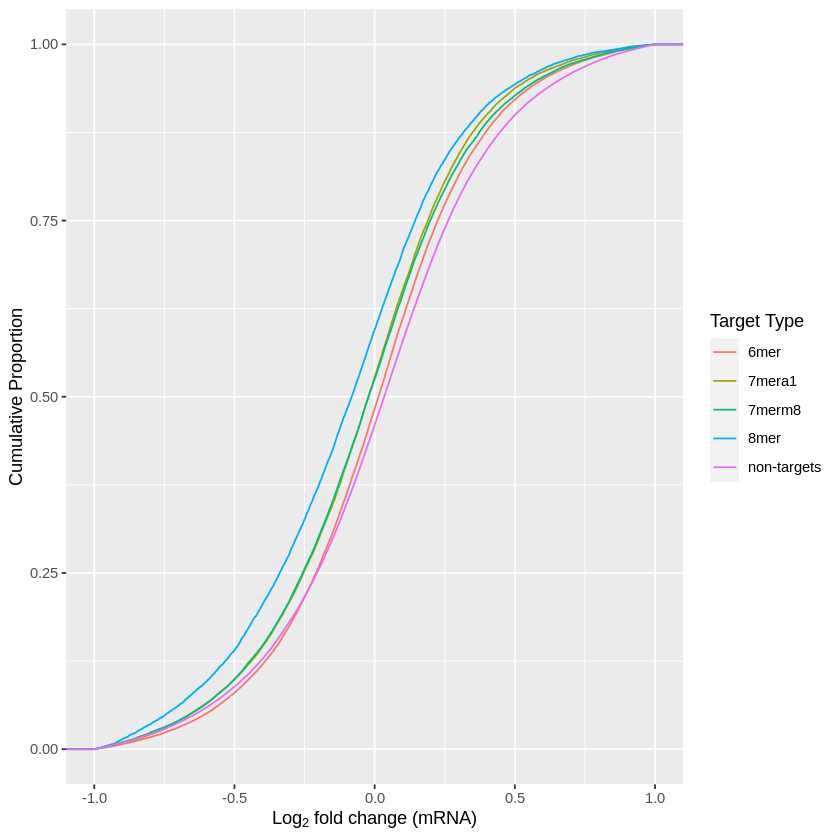
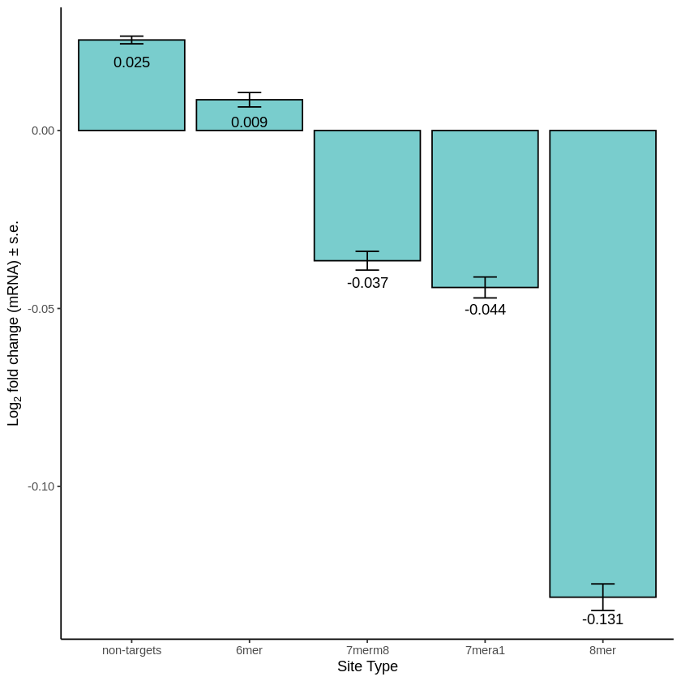
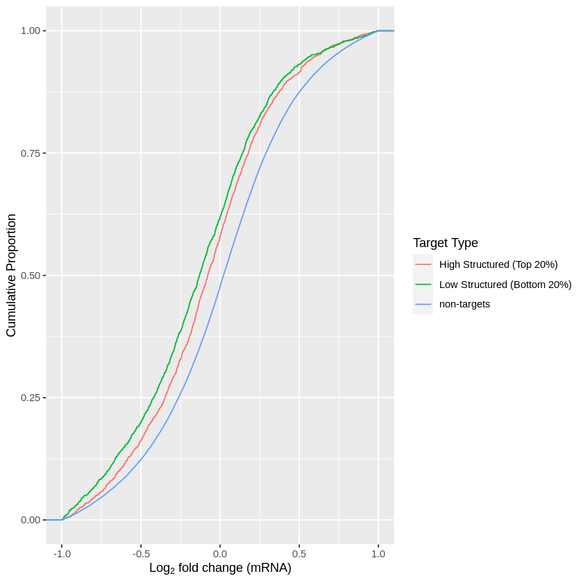
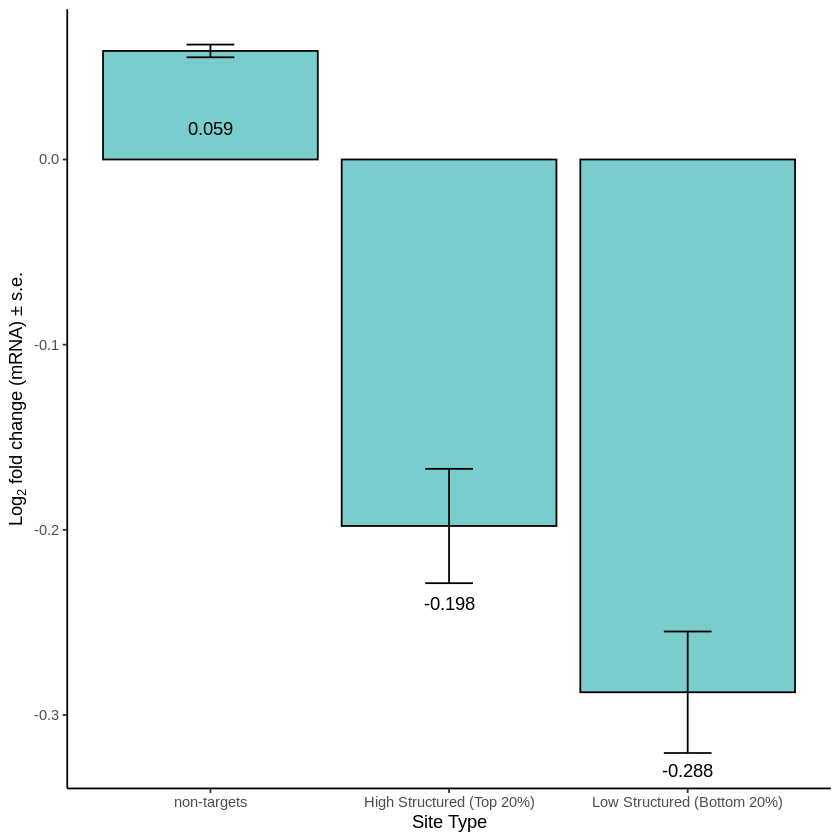
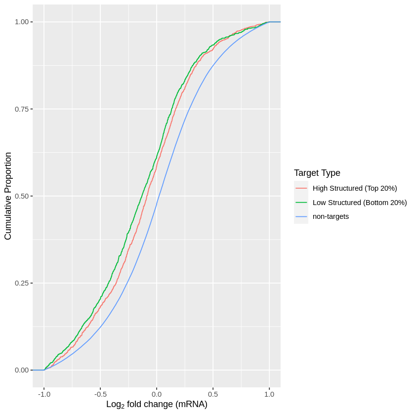
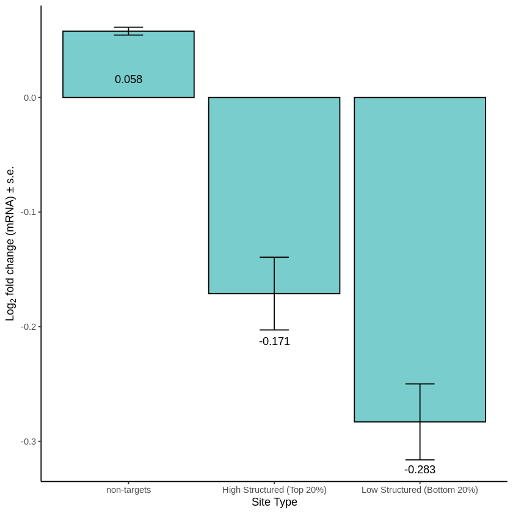

```R
library(ggplot2)
```


```R
library(dplyr)
```

    Warning message:
    “package ‘dplyr’ was built under R version 3.6.3”
    
    Attaching package: ‘dplyr’
    
    
    The following objects are masked from ‘package:stats’:
    
        filter, lag
    
    
    The following objects are masked from ‘package:base’:
    
        intersect, setdiff, setequal, union
    
    


```R
avr <- read.csv('targets.csv')
```


```R
ggplot(avr, aes(b, colour = type)) + stat_ecdf(geom = "step") + xlim(-1, 1) + xlab(expression('Log'[2]*' fold change (mRNA)')) + ylab("Cumulative Proportion") + labs(color='Target Type') 
```

    Warning message:
    “Removed 31835 rows containing non-finite values (stat_ecdf).”


    

    


```R
eightmer <- avr[avr$type=="8mer",]
sevenmera1 <- avr[avr$type=="7mera1",]
sevenmerm8 <- avr[avr$type=="7merm8",]
sixmer <- avr[avr$type=="6mer",]
nontarget <- avr[avr$type=="non-targets",]
print(nrow(eightmer) / 25)
print(nrow(sevenmera1) / 25)
print(nrow(sevenmerm8) / 25)
print(nrow(sixmer) / 25)
print(nrow(nontarget ) / 25)
avr_counts <- c(nrow(eightmer) / 25, nrow(sevenmera1) / 25, nrow(sevenmerm8) / 25, nrow(sixmer) / 25, nrow(nontarget ) / 25)
groups <- c('8mer', '7mera1', '7merm8', '6mer', 'non-targets')
avr_count_seed_types <- data.frame(avr_counts, groups)
print(ks.ts <- ks.test(eightmer[,"b"], nontarget[,"b"], alternative = "two.sided"))
print(ks.ts <- ks.test(sevenmera1[,"b"], nontarget[,"b"], alternative = "two.sided"))
print(ks.ts <- ks.test(sevenmerm8[,"b"], nontarget[,"b"], alternative = "two.sided"))
print(ks.ts <- ks.test(sixmer[,"b"], nontarget[,"b"], alternative = "two.sided"))
print(anno <- t.test(eightmer[,"b"], nontarget[,"b"]))
print(anno <- t.test(sevenmera1[,"b"], nontarget[,"b"]))
print(anno <- t.test(sevenmerm8[,"b"], nontarget[,"b"]))
print(anno <- t.test(sixmer[,"b"], nontarget[,"b"]))
print(anno <- t.test(sixmer[,"b"], nontarget[,"b"]))
```

    [1] 751.44
    [1] 1083.6
    [1] 1466.08
    [1] 2373.88
    [1] 13258.12


    Warning message in ks.test(eightmer[, "b"], nontarget[, "b"], alternative = "two.sided"):
    “p-value will be approximate in the presence of ties”


    
    	Two-sample Kolmogorov-Smirnov test
    
    data:  eightmer[, "b"] and nontarget[, "b"]
    D = 0.14308, p-value < 2.2e-16
    alternative hypothesis: two-sided
    


    Warning message in ks.test(sevenmera1[, "b"], nontarget[, "b"], alternative = "two.sided"):
    “p-value will be approximate in the presence of ties”


    
    	Two-sample Kolmogorov-Smirnov test
    
    data:  sevenmera1[, "b"] and nontarget[, "b"]
    D = 0.080943, p-value < 2.2e-16
    alternative hypothesis: two-sided
    


    Warning message in ks.test(sevenmerm8[, "b"], nontarget[, "b"], alternative = "two.sided"):
    “p-value will be approximate in the presence of ties”


    
    	Two-sample Kolmogorov-Smirnov test
    
    data:  sevenmerm8[, "b"] and nontarget[, "b"]
    D = 0.07117, p-value < 2.2e-16
    alternative hypothesis: two-sided
    


    Warning message in ks.test(sixmer[, "b"], nontarget[, "b"], alternative = "two.sided"):
    “p-value will be approximate in the presence of ties”


    
    	Two-sample Kolmogorov-Smirnov test
    
    data:  sixmer[, "b"] and nontarget[, "b"]
    D = 0.04097, p-value < 2.2e-16
    alternative hypothesis: two-sided
    
    
    	Welch Two Sample t-test
    
    data:  eightmer[, "b"] and nontarget[, "b"]
    t = -40.313, df = 22052, p-value < 2.2e-16
    alternative hypothesis: true difference in means is not equal to 0
    95 percent confidence interval:
     -0.1642050 -0.1489776
    sample estimates:
      mean of x   mean of y 
    -0.13113204  0.02545925 
    
    
    	Welch Two Sample t-test
    
    data:  sevenmera1[, "b"] and nontarget[, "b"]
    t = -22.179, df = 34809, p-value < 2.2e-16
    alternative hypothesis: true difference in means is not equal to 0
    95 percent confidence interval:
     -0.07570050 -0.06340734
    sample estimates:
      mean of x   mean of y 
    -0.04409467  0.02545925 
    
    
    	Welch Two Sample t-test
    
    data:  sevenmerm8[, "b"] and nontarget[, "b"]
    t = -21.8, df = 49849, p-value < 2.2e-16
    alternative hypothesis: true difference in means is not equal to 0
    95 percent confidence interval:
     -0.06761796 -0.05646217
    sample estimates:
      mean of x   mean of y 
    -0.03658082  0.02545925 
    
    
    	Welch Two Sample t-test
    
    data:  sixmer[, "b"] and nontarget[, "b"]
    t = -7.3205, df = 96480, p-value = 2.489e-13
    alternative hypothesis: true difference in means is not equal to 0
    95 percent confidence interval:
     -0.02129467 -0.01230008
    sample estimates:
      mean of x   mean of y 
    0.008661875 0.025459247 
    
    
    	Welch Two Sample t-test
    
    data:  sixmer[, "b"] and nontarget[, "b"]
    t = -7.3205, df = 96480, p-value = 2.489e-13
    alternative hypothesis: true difference in means is not equal to 0
    95 percent confidence interval:
     -0.02129467 -0.01230008
    sample estimates:
      mean of x   mean of y 
    0.008661875 0.025459247 
    


```R
summary <- avr %>% # the names of the new data frame and the data frame to be summarised
  group_by(type) %>%   # the grouping variable
summarise(mean = mean(b),  # calculates the mean of each group
            sd = sd(b), # calculates the standard deviation of each group
            n = n(),  # calculates the sample size per group
            SE = sd(b)/sqrt(n())) # calculates the standard error of each group
```


```R
ggplot(summary, aes(x = reorder(type, -mean), y = mean)) + 
                   geom_col() + geom_bar(stat="identity", color="black", fill ="darkslategray3") + 
                   geom_errorbar(aes(ymin = mean - SE, ymax = mean + SE), width=0.2) + labs(y=expression('Log'[2]*' fold change (mRNA) ± s.e.'), x = "Site Type") + theme_classic() + geom_text(aes(label=round(mean, digits = 3)), position=position_dodge(width=0.9), vjust=2.6)

```


    

    


```R
ggsave(myplot, file=paste0("avr_bar.png"))
```

    Saving 6.67 x 6.67 in image
    


```R
shape_avr <- read.csv('combined_shape_all.csv')
```


```R
ggplot(shape_avr, aes(b, colour = type)) + stat_ecdf(geom = "step") + xlim(-1, 1) + xlab(expression('Log'[2]*' fold change (mRNA)')) + ylab("Cumulative Proportion") + labs(color='Target Type') 
```

    Warning message:
    “Removed 50048 rows containing non-finite values (stat_ecdf).”


    

    


```R
ggsave(myplot, file=paste("avr_shape_ecdf.png"))
```

    Saving 6.67 x 6.67 in image
    
    Warning message:
    “Removed 50048 rows containing non-finite values (stat_ecdf).”


```R
high <- shape_avr[shape_avr$type=="High Structured (Top 20%)",]
low <- shape_avr[shape_avr$type=="Low Structured (Bottom 20%)",]
nontarget <- shape_avr[shape_avr$type=="non-targets",]
avr_counts <- c(nrow(high) / 25, nrow(low) / 25, nrow(nontarget) / 25)
groups <- c('High Structured', 'Low Structured ','non-targets')
avr_count_seed_types <- data.frame(avr_counts, groups)
print(ks.ts <- ks.test(high[,"b"], nontarget[,"b"], alternative = "two.sided"))
print(ks.ts <- ks.test(low[,"b"], nontarget[,"b"], alternative = "two.sided"))
print(ks.ts <- ks.test(high[,"b"], low[,"b"], alternative = "two.sided"))
print(anno <- t.test(high[,"b"], nontarget[,"b"]))
print(anno <- t.test(low[,"b"], nontarget[,"b"]))
print(anno <- t.test(high[,"b"], low[,"b"]))
```

    Warning message in ks.test(high[, "b"], nontarget[, "b"], alternative = "two.sided"):
    “p-value will be approximate in the presence of ties”


    
    	Two-sample Kolmogorov-Smirnov test
    
    data:  high[, "b"] and nontarget[, "b"]
    D = 0.12921, p-value < 2.2e-16
    alternative hypothesis: two-sided
    


    Warning message in ks.test(low[, "b"], nontarget[, "b"], alternative = "two.sided"):
    “p-value will be approximate in the presence of ties”


    
    	Two-sample Kolmogorov-Smirnov test
    
    data:  low[, "b"] and nontarget[, "b"]
    D = 0.16538, p-value < 2.2e-16
    alternative hypothesis: two-sided
    


    Warning message in ks.test(high[, "b"], low[, "b"], alternative = "two.sided"):
    “p-value will be approximate in the presence of ties”


    
    	Two-sample Kolmogorov-Smirnov test
    
    data:  high[, "b"] and low[, "b"]
    D = 0.064671, p-value = 0.0003562
    alternative hypothesis: two-sided
    
    
    	Welch Two Sample t-test
    
    data:  high[, "b"] and nontarget[, "b"]
    t = -8.26, df = 2141.2, p-value = 2.519e-16
    alternative hypothesis: true difference in means is not equal to 0
    95 percent confidence interval:
     -0.3174376 -0.1956269
    sample estimates:
      mean of x   mean of y 
    -0.19791316  0.05861907 
    
    
    	Welch Two Sample t-test
    
    data:  low[, "b"] and nontarget[, "b"]
    t = -10.5, df = 2083.1, p-value < 2.2e-16
    alternative hypothesis: true difference in means is not equal to 0
    95 percent confidence interval:
     -0.4109965 -0.2816355
    sample estimates:
      mean of x   mean of y 
    -0.28769689  0.05861907 
    
    
    	Welch Two Sample t-test
    
    data:  high[, "b"] and low[, "b"]
    t = 1.9934, df = 4105.1, p-value = 0.04628
    alternative hypothesis: true difference in means is not equal to 0
    95 percent confidence interval:
     0.001479434 0.178088009
    sample estimates:
     mean of x  mean of y 
    -0.1979132 -0.2876969 
    


```R
summary <- shape_avr %>% # the names of the new data frame and the data frame to be summarised
  group_by(type) %>%   # the grouping variable
summarise(mean = mean(b),  # calculates the mean of each group
            sd = sd(b), # calculates the standard deviation of each group
            n = n(),  # calculates the sample size per group
            SE = sd(b)/sqrt(n())) # calculates the standard error of each group
```


```R
ggplot(summary, aes(x = reorder(type, -mean), y = mean)) + 
                   geom_col() + geom_bar(stat="identity", color="black", fill ="darkslategray3") + 
                   geom_errorbar(aes(ymin = mean - SE, ymax = mean + SE), width=0.2) + labs(y=expression('Log'[2]*' fold change (mRNA) ± s.e.'), x = "Site Type") + theme_classic() + geom_text(aes(label=round(mean, digits = 3)), position=position_dodge(width=0.9), vjust=6.5)

```


    

    


```R
ggsave(myplot, file=paste("avr_shape_bar.png"))
```

    Saving 6.67 x 6.67 in image
    


```R
shape_avr_flank <- read.csv('combined_shape_flank_all_5.csv')
```


```R
ggplot(shape_avr_flank, aes(b, colour = type)) + stat_ecdf(geom = "step") + xlim(-1, 1) + xlab(expression('Log'[2]*' fold change (mRNA)')) + ylab("Cumulative Proportion") + labs(color='Target Type') 
```

    Warning message:
    “Removed 50048 rows containing non-finite values (stat_ecdf).”


    

    


```R
ggsave(myplot, file=paste("avr_shape_flank_ecdf_5.png"))
```

    Saving 6.67 x 6.67 in image
    
    Warning message:
    “Removed 50048 rows containing non-finite values (stat_ecdf).”


```R
high <- shape_avr_flank[shape_avr_flank$type=="High Structured (Top 20%)",]
low <- shape_avr_flank[shape_avr_flank$type=="Low Structured (Bottom 20%)",]
nontarget <- shape_avr_flank[shape_avr_flank$type=="non-targets",]
avr_counts <- c(nrow(high) / 25, nrow(low) / 25, nrow(nontarget) / 25)
groups <- c('High Structured', 'Low Structured ','non-targets')
avr_count_seed_types <- data.frame(avr_counts, groups)
print(ks.ts <- ks.test(high[,"b"], nontarget[,"b"], alternative = "two.sided"))
print(ks.ts <- ks.test(low[,"b"], nontarget[,"b"], alternative = "two.sided"))
print(ks.ts <- ks.test(high[,"b"], low[,"b"], alternative = "two.sided"))
print(anno <- t.test(high[,"b"], nontarget[,"b"]))
print(anno <- t.test(low[,"b"], nontarget[,"b"]))
print(anno <- t.test(high[,"b"], low[,"b"]))
```

    Warning message in ks.test(high[, "b"], nontarget[, "b"], alternative = "two.sided"):
    “p-value will be approximate in the presence of ties”


    
    	Two-sample Kolmogorov-Smirnov test
    
    data:  high[, "b"] and nontarget[, "b"]
    D = 0.12703, p-value < 2.2e-16
    alternative hypothesis: two-sided
    


    Warning message in ks.test(low[, "b"], nontarget[, "b"], alternative = "two.sided"):
    “p-value will be approximate in the presence of ties”


    
    	Two-sample Kolmogorov-Smirnov test
    
    data:  low[, "b"] and nontarget[, "b"]
    D = 0.15749, p-value < 2.2e-16
    alternative hypothesis: two-sided
    


    Warning message in ks.test(high[, "b"], low[, "b"], alternative = "two.sided"):
    “p-value will be approximate in the presence of ties”


    
    	Two-sample Kolmogorov-Smirnov test
    
    data:  high[, "b"] and low[, "b"]
    D = 0.058622, p-value = 0.002664
    alternative hypothesis: two-sided
    
    
    	Welch Two Sample t-test
    
    data:  high[, "b"] and nontarget[, "b"]
    t = -7.1723, df = 1996, p-value = 1.035e-12
    alternative hypothesis: true difference in means is not equal to 0
    95 percent confidence interval:
     -0.2916135 -0.1663816
    sample estimates:
      mean of x   mean of y 
    -0.17111453  0.05788301 
    
    
    	Welch Two Sample t-test
    
    data:  low[, "b"] and nontarget[, "b"]
    t = -10.229, df = 1943.1, p-value < 2.2e-16
    alternative hypothesis: true difference in means is not equal to 0
    95 percent confidence interval:
     -0.4062823 -0.2755516
    sample estimates:
      mean of x   mean of y 
    -0.28303392  0.05788301 
    
    
    	Welch Two Sample t-test
    
    data:  high[, "b"] and low[, "b"]
    t = 2.4384, df = 3840, p-value = 0.0148
    alternative hypothesis: true difference in means is not equal to 0
    95 percent confidence interval:
     0.02193289 0.20190588
    sample estimates:
     mean of x  mean of y 
    -0.1711145 -0.2830339 
    


```R
summary <- shape_avr_flank %>% # the names of the new data frame and the data frame to be summarised
  group_by(type) %>%   # the grouping variable
summarise(mean = mean(b),  # calculates the mean of each group
            sd = sd(b), # calculates the standard deviation of each group
            n = n(),  # calculates the sample size per group
            SE = sd(b)/sqrt(n())) # calculates the standard error of each group
```


```R
ggplot(summary, aes(x = reorder(type, -mean), y = mean)) + 
                   geom_col() + geom_bar(stat="identity", color="black", fill ="darkslategray3") + 
                   geom_errorbar(aes(ymin = mean - SE, ymax = mean + SE), width=0.2) + labs(y=expression('Log'[2]*' fold change (mRNA) ± s.e.'), x = "Site Type") + theme_classic() + geom_text(aes(label=round(mean, digits = 3)), position=position_dodge(width=0.9), vjust=6.5)

```


    

    


```R
ggsave(myplot, file=paste("avr_shape_flank_bar_5.png"))
```

    Saving 6.67 x 6.67 in image
    
