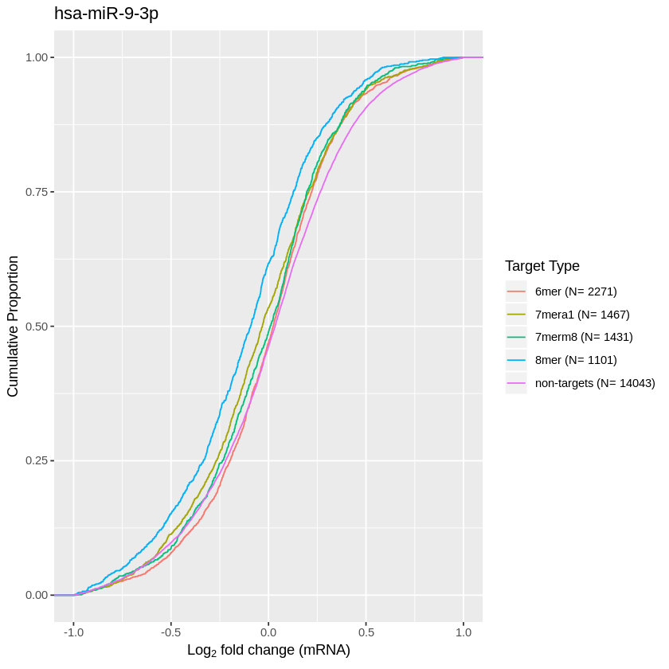

# Differential Expression Analysis

## Part 1 - Downloading the data
The first stage in the analysis pipeline is downloading the corresponding data files.

The data used in this research comes from a large-scale RNA sequencing study that experimentally identified genes that are downregulated by 25 miRNAs, found [here](https://www.ebi.ac.uk/ena/browser/view/PRJNA512378). This data set contains 52 samples and is made up of 2 controls and 25 transfections with duplicates. A bash script (found below) was used to download each file from the ENA FTP server onto the high performance cluster, ready for processing. Due to the way the ENA FTP server was structured several directories had to be checked for the appropriate file.

```bash
#!/bin/bash
#SBATCH --mail-user=naa17jnu@uea.ac.uk
#SBATCH --mail-type=END
cat accessions.txt | while read line
do
    echo "Reading ${line}"
    if [ ! -f /gpfs/home/naa17jnu/scratch/seq_runs/${line}.fastq.gz ] # check if file doesnt already exist
    then
        echo "File ${line} doesnt exist - downloading"
        if wget --spider ftp://ftp.sra.ebi.ac.uk/vol1/fastq/SRR838/000/${line}/${line}.fastq.gz 2>/dev/null # Check if file exists in vol000
        then
            echo "Found ${line}.fastq.gz on 000"
            wget ftp://ftp.sra.ebi.ac.uk/vol1/fastq/SRR838/000/${line}/${line}.fastq.gz -P /gpfs/home/naa17jnu/scratch/seq_runs # If it does exist in vol000 then download
        fi
        if wget --spider ftp://ftp.sra.ebi.ac.uk/vol1/fastq/SRR838/001/${line}/${line}.fastq.gz 2>/dev/null # If not check next vol - until it is found
        then
            echo "Found ${line}.fastq.gz on 001"
            wget ftp://ftp.sra.ebi.ac.uk/vol1/fastq/SRR838/001/${line}/${line}.fastq.gz -P /gpfs/home/naa17jnu/scratch/seq_runs
        fi
        if wget --spider ftp://ftp.sra.ebi.ac.uk/vol1/fastq/SRR838/002/${line}/${line}.fastq.gz 2>/dev/null
        then
            echo "Found ${line}.fastq.gz on 002"
            wget ftp://ftp.sra.ebi.ac.uk/vol1/fastq/SRR838/002/${line}/${line}.fastq.gz -P /gpfs/home/naa17jnu/scratch/seq_runs
        fi
        if wget --spider ftp://ftp.sra.ebi.ac.uk/vol1/fastq/SRR838/003/${line}/${line}.fastq.gz 2>/dev/null
        then
            echo "Found ${line}.fastq.gz on 003"
            wget ftp://ftp.sra.ebi.ac.uk/vol1/fastq/SRR838/003/${line}/${line}.fastq.gz -P /gpfs/home/naa17jnu/scratch/seq_runs
        fi
        if wget --spider ftp://ftp.sra.ebi.ac.uk/vol1/fastq/SRR838/004/${line}/${line}.fastq.gz 2>/dev/null
        then
            echo "Found ${line}.fastq.gz on 004"
            wget ftp://ftp.sra.ebi.ac.uk/vol1/fastq/SRR838/004/${line}/${line}.fastq.gz -P /gpfs/home/naa17jnu/scratch/seq_runs
        fi
        if wget --spider ftp://ftp.sra.ebi.ac.uk/vol1/fastq/SRR838/005/${line}/${line}.fastq.gz 2>/dev/null
        then
            echo "Found ${line}.fastq.gz on 005"
            wget ftp://ftp.sra.ebi.ac.uk/vol1/fastq/SRR838/005/${line}/${line}.fastq.gz -P /gpfs/home/naa17jnu/scratch/seq_runs
        fi
        if wget --spider ftp://ftp.sra.ebi.ac.uk/vol1/fastq/SRR838/006/${line}/${line}.fastq.gz 2>/dev/null
        then
            echo "Found ${line}.fastq.gz on 006"
            wget ftp://ftp.sra.ebi.ac.uk/vol1/fastq/SRR838/006/${line}/${line}.fastq.gz -P /gpfs/home/naa17jnu/scratch/seq_runs
        fi
        if wget --spider ftp://ftp.sra.ebi.ac.uk/vol1/fastq/SRR838/007/${line}/${line}.fastq.gz 2>/dev/null
        then
            echo "Found ${line}.fastq.gz on 007"
            wget ftp://ftp.sra.ebi.ac.uk/vol1/fastq/SRR838/007/${line}/${line}.fastq.gz -P /gpfs/home/naa17jnu/scratch/seq_runs
        fi
        if wget --spider ftp://ftp.sra.ebi.ac.uk/vol1/fastq/SRR838/008/${line}/${line}.fastq.gz 2>/dev/null
        then
            echo "Found ${line}.fastq.gz on 008"
            wget ftp://ftp.sra.ebi.ac.uk/vol1/fastq/SRR838/008/${line}/${line}.fastq.gz -P /gpfs/home/naa17jnu/scratch/seq_runs
        fi
         if wget --spider ftp://ftp.sra.ebi.ac.uk/vol1/fastq/SRR838/009/${line}/${line}.fastq.gz 2>/dev/null
        then
            echo "Found ${line}.fastq.gz on 008"
            wget ftp://ftp.sra.ebi.ac.uk/vol1/fastq/SRR838/009/${line}/${line}.fastq.gz -P /gpfs/home/naa17jnu/scratch/seq_runs
        fi
    fi
done
```

The following 52 files were downloaded in FASTQ format


```bash
%%bash
cd /gpfs/home/naa17jnu/scratch/seq_runs
ls
```

    SRR8382192.fastq.gz
    SRR8382193.fastq.gz
    SRR8382194.fastq.gz
    SRR8382195.fastq.gz
    SRR8382196.fastq.gz
    SRR8382197.fastq.gz
    SRR8382198.fastq.gz
    SRR8382199.fastq.gz
    SRR8382200.fastq.gz
    SRR8382201.fastq.gz
    SRR8382202.fastq.gz
    SRR8382203.fastq.gz
    SRR8382204.fastq.gz
    SRR8382205.fastq.gz
    SRR8382206.fastq.gz
    SRR8382207.fastq.gz
    SRR8382208.fastq.gz
    SRR8382209.fastq.gz
    SRR8382210.fastq.gz
    SRR8382211.fastq.gz
    SRR8382212.fastq.gz
    SRR8382213.fastq.gz
    SRR8382214.fastq.gz
    SRR8382215.fastq.gz
    SRR8382216.fastq.gz
    SRR8382217.fastq.gz
    SRR8382218.fastq.gz
    SRR8382219.fastq.gz
    SRR8382220.fastq.gz
    SRR8382221.fastq.gz
    SRR8382222.fastq.gz
    SRR8382223.fastq.gz
    SRR8382224.fastq.gz
    SRR8382225.fastq.gz
    SRR8382226.fastq.gz
    SRR8382227.fastq.gz
    SRR8382228.fastq.gz
    SRR8382229.fastq.gz
    SRR8382230.fastq.gz
    SRR8382231.fastq.gz
    SRR8382232.fastq.gz
    SRR8382233.fastq.gz
    SRR8382234.fastq.gz
    SRR8382235.fastq.gz
    SRR8382236.fastq.gz
    SRR8382237.fastq.gz
    SRR8382238.fastq.gz
    SRR8382239.fastq.gz
    SRR8382240.fastq.gz
    SRR8382241.fastq.gz
    SRR8382242.fastq.gz
    SRR8382243.fastq.gz


## Part 2 - Quality Control

The next stage of the analysis is to perform quality control on the FASTQ data.
This was carried out using FastQC and fastP - two tools to anaylse and then clean FASTQ data respectively.

### FastQC

The following bash script was used to run FastQC on each of our fastq files.

```bash
#!/bin/bash
#SBATCH --mail-user=naa17jnu@uea.ac.uk
#SBATCH --mail-type=END


# MUST DO module load fastqc/0.11.9 before running
module load fastqc/0.11.9
cat accessions.txt | while read line
do
    echo "Analysing${line}"
    fastqc /gpfs/home/naa17jnu/scratch/seq_runs/${line}.fastq.gz --outdir /gpfs/home/naa17jnu/scratch/fastqc_analysis
    echo "Done"
done
```

This produces a report for each of our fastq files giving detailed insight into the quality of each file. In order to get a better overview of the quality of the entire dataset I used [multiQC](https://multiqc.info/), a tool for compiling the outputs of various bioinformatics tools.


### FastP

Each fastq file was then cleaned using FastP to remove adapter squences using the following bash script
```bash
#!/bin/bash
#SBATCH --mail-user=naa17jnu@uea.ac.uk
#SBATCH --mail-type=END

cat accessions.txt | while read line
do
    echo "Cleaning ${line}"
    ./fastp -i /gpfs/home/naa17jnu/scratch/seq_runs/${line}.fastq.gz -o /gpfs/home/naa17jnu/scratch/fastp/${line}_clean.fastq.gz -Q -L -j ${line}.json - h ${line}.html -R "${line}"
    echo "Done"
done
```
This resulted in cleaned versions of the 52 fastq files.


```bash
%%bash
cd /gpfs/home/naa17jnu/scratch/fastp
ls
```

    reports
    SRR8382192_clean.fastq.gz
    SRR8382193_clean.fastq.gz
    SRR8382194_clean.fastq.gz
    SRR8382195_clean.fastq.gz
    SRR8382196_clean.fastq.gz
    SRR8382197_clean.fastq.gz
    SRR8382198_clean.fastq.gz
    SRR8382199_clean.fastq.gz
    SRR8382200_clean.fastq.gz
    SRR8382201_clean.fastq.gz
    SRR8382202_clean.fastq.gz
    SRR8382203_clean.fastq.gz
    SRR8382204_clean.fastq.gz
    SRR8382205_clean.fastq.gz
    SRR8382206_clean.fastq.gz
    SRR8382207_clean.fastq.gz
    SRR8382208_clean.fastq.gz
    SRR8382209_clean.fastq.gz
    SRR8382210_clean.fastq.gz
    SRR8382211_clean.fastq.gz
    SRR8382212_clean.fastq.gz
    SRR8382213_clean.fastq.gz
    SRR8382214_clean.fastq.gz
    SRR8382215_clean.fastq.gz
    SRR8382216_clean.fastq.gz
    SRR8382217_clean.fastq.gz
    SRR8382218_clean.fastq.gz
    SRR8382219_clean.fastq.gz
    SRR8382220_clean.fastq.gz
    SRR8382221_clean.fastq.gz
    SRR8382222_clean.fastq.gz
    SRR8382223_clean.fastq.gz
    SRR8382224_clean.fastq.gz
    SRR8382225_clean.fastq.gz
    SRR8382226_clean.fastq.gz
    SRR8382227_clean.fastq.gz
    SRR8382228_clean.fastq.gz
    SRR8382229_clean.fastq.gz
    SRR8382230_clean.fastq.gz
    SRR8382231_clean.fastq.gz
    SRR8382232_clean.fastq.gz
    SRR8382233_clean.fastq.gz
    SRR8382234_clean.fastq.gz
    SRR8382235_clean.fastq.gz
    SRR8382236_clean.fastq.gz
    SRR8382237_clean.fastq.gz
    SRR8382238_clean.fastq.gz
    SRR8382239_clean.fastq.gz
    SRR8382240_clean.fastq.gz
    SRR8382241_clean.fastq.gz
    SRR8382242_clean.fastq.gz
    SRR8382243_clean.fastq.gz


## Part 3 - Pseudo alignment

The next stage of the analysis is to align the fastq files to the reference genome. This was carried out using kallisto.

The first step in using kallisto is to download the reference transcriptome that kallisto can use as an index. This was the Homo_sapiens.GRCh38.cdna.all obatined from ensembl and found [here](http://ftp.ensembl.org/pub/release-103/fasta/homo_sapiens/cdna/).

```bash
wget http://ftp.ensembl.org/pub/release-103/fasta/homo_sapiens/cdna/Homo_sapiens.GRCh38.cdna.all.fa.gz
```
Once the reference transcriptome file has been downloaded kallisto was used to generate an index ready for the pseudoalignment step.
```bash
module load kallisto/0.46.1
kallisto index -i Homo_sapiens.GRCh38.cdna.idx Homo_sapiens.GRCh38.cdna.all.fa.gz
```

The following bash script was then used to run kallisto on each of the cleaned files:

```bash
#!/bin/bash
#SBATCH --mail-user=naa17jnu@uea.ac.uk
#SBATCH --mail-type=END

#Before running generate index file - kallisto index -i filename

# DO module load kallisto/0.46.1
module load kallisto/0.46.1
line=$1
echo "Reading ${line}"
if [ -f /gpfs/home/naa17jnu/scratch/fastp/${line}_clean.fastq.gz ] # check clean file actually exists
then
echo "File exists at /gpfs/home/naa17jnu/scratch/fastp/${line}_clean.fastq.gz" 
    if [ ! -f ${line}_block ] # check kallisto isnt in progress
    then
        echo "Running kallisto on ${line}"
        touch ${line}_block
        kallisto quant -i /gpfs/home/naa17jnu/scratch/kallisto/homo_sapiens_GRCh38 --single --fragment-length=180 --sd=20 --bias -b 100 -o /gpfs/home/naa17jnu/scratch/kallisto/${line}_kallisto /gpfs/home/naa17jnu/scratch/fastp/${line}_clean.fastq.gz 2>&1 | tee ${line}_stdout.txt
    else
        echo "Block file found - is kallisto running already?"
    fi
else
    echo "Cleaned file not found"
fi
rm -f ${line}_block
done

```
The results of the main quantification, i.e. the abundance estimate using kallisto on the data is in the abundance.tsv file. Abundances are reported in “estimated counts” (est_counts) and in Transcripts Per Million (TPM).


```bash
%%bash
cd /gpfs/home/naa17jnu/scratch/kallisto/SRR8382192
head abundance.tsv
```

    target_id	length	eff_length	est_counts	tpm
    ENST00000631435.1	12	2.81731	0	0
    ENST00000415118.1	8	2.64436	0	0
    ENST00000434970.2	9	2.70348	0	0
    ENST00000448914.1	13	2.84272	0	0
    ENST00000632684.1	12	2.81731	0	0
    ENST00000632524.1	11	2.78701	0	0
    ENST00000633009.1	20	2.96527	0	0
    ENST00000634070.1	18	2.93465	0	0
    ENST00000632963.1	20	2.96527	0	0


## Part 4 - Differential Expression analysis with sleuth

The next stage is analysing the kallisto output. To do this I used sleuth, a companion tool to kallisto that can directly analyse the kallisto output.

First we load sleuth into R.


```R
suppressMessages({
  library("sleuth")
})
```

Then we create a list of paths to the transcript abundance files to use as input for the Sleuth analysis.


```R
sample_id <- dir(file.path("..", "scratch", "kallisto"))
kal_dirs <- file.path("..", "scratch", "kallisto", sample_id)
kal_dirs
```


<ol class=list-inline>
	<li>'../scratch/kallisto/SRR8382192'</li>
	<li>'../scratch/kallisto/SRR8382193'</li>
	<li>'../scratch/kallisto/SRR8382194'</li>
	<li>'../scratch/kallisto/SRR8382195'</li>
	<li>'../scratch/kallisto/SRR8382196'</li>
	<li>'../scratch/kallisto/SRR8382197'</li>
	<li>'../scratch/kallisto/SRR8382198'</li>
	<li>'../scratch/kallisto/SRR8382199'</li>
	<li>'../scratch/kallisto/SRR8382200'</li>
	<li>'../scratch/kallisto/SRR8382201'</li>
	<li>'../scratch/kallisto/SRR8382202'</li>
	<li>'../scratch/kallisto/SRR8382203'</li>
	<li>'../scratch/kallisto/SRR8382204'</li>
	<li>'../scratch/kallisto/SRR8382205'</li>
	<li>'../scratch/kallisto/SRR8382206'</li>
	<li>'../scratch/kallisto/SRR8382207'</li>
	<li>'../scratch/kallisto/SRR8382208'</li>
	<li>'../scratch/kallisto/SRR8382209'</li>
	<li>'../scratch/kallisto/SRR8382210'</li>
	<li>'../scratch/kallisto/SRR8382211'</li>
	<li>'../scratch/kallisto/SRR8382212'</li>
	<li>'../scratch/kallisto/SRR8382213'</li>
	<li>'../scratch/kallisto/SRR8382214'</li>
	<li>'../scratch/kallisto/SRR8382215'</li>
	<li>'../scratch/kallisto/SRR8382216'</li>
	<li>'../scratch/kallisto/SRR8382217'</li>
	<li>'../scratch/kallisto/SRR8382218'</li>
	<li>'../scratch/kallisto/SRR8382219'</li>
	<li>'../scratch/kallisto/SRR8382220'</li>
	<li>'../scratch/kallisto/SRR8382221'</li>
	<li>'../scratch/kallisto/SRR8382222'</li>
	<li>'../scratch/kallisto/SRR8382223'</li>
	<li>'../scratch/kallisto/SRR8382224'</li>
	<li>'../scratch/kallisto/SRR8382225'</li>
	<li>'../scratch/kallisto/SRR8382226'</li>
	<li>'../scratch/kallisto/SRR8382227'</li>
	<li>'../scratch/kallisto/SRR8382228'</li>
	<li>'../scratch/kallisto/SRR8382229'</li>
	<li>'../scratch/kallisto/SRR8382230'</li>
	<li>'../scratch/kallisto/SRR8382231'</li>
	<li>'../scratch/kallisto/SRR8382232'</li>
	<li>'../scratch/kallisto/SRR8382233'</li>
	<li>'../scratch/kallisto/SRR8382234'</li>
	<li>'../scratch/kallisto/SRR8382235'</li>
	<li>'../scratch/kallisto/SRR8382236'</li>
	<li>'../scratch/kallisto/SRR8382237'</li>
	<li>'../scratch/kallisto/SRR8382238'</li>
	<li>'../scratch/kallisto/SRR8382239'</li>
	<li>'../scratch/kallisto/SRR8382240'</li>
	<li>'../scratch/kallisto/SRR8382241'</li>
	<li>'../scratch/kallisto/SRR8382242'</li>
	<li>'../scratch/kallisto/SRR8382243'</li>
</ol>


Then we read in the metadata table assocaited with the kallisto files.


```R
s2c <- read.csv(file.path("..","scratch", "sleuth", "metadata.csv"), header = TRUE, stringsAsFactors=FALSE)
head(s2c)
```


<table>
<thead><tr><th scope=col>run</th><th scope=col>condition</th></tr></thead>
<tbody>
	<tr><td>SRR8382192    </td><td>hsa-let-7c-5p </td></tr>
	<tr><td>SRR8382193    </td><td>hsa-let-7c-5p </td></tr>
	<tr><td>SRR8382194    </td><td>hsa-miR-107   </td></tr>
	<tr><td>SRR8382195    </td><td>hsa-miR-107   </td></tr>
	<tr><td>SRR8382196    </td><td>hsa-miR-10a-5p</td></tr>
	<tr><td>SRR8382197    </td><td>hsa-miR-10a-5p</td></tr>
</tbody>
</table>


Sleuth expects the data to be presented in a specific format with specific column and row names:

It requires a column entitled “sample” containing the sample names; A condition containing the sample conditions and a path specifying the location of the abundence files.

We rename the metatable table to adhere to sleuth, and then combine it with the kallisto paths.


```R
s2c <- dplyr::select(s2c, sample = run, condition)
s2c <- dplyr::mutate(s2c, path = kal_dirs)
head(s2c)
```


<table>
<thead><tr><th scope=col>sample</th><th scope=col>condition</th><th scope=col>path</th></tr></thead>
<tbody>
	<tr><td>SRR8382192                    </td><td>hsa-let-7c-5p                 </td><td>../scratch/kallisto/SRR8382192</td></tr>
	<tr><td>SRR8382193                    </td><td>hsa-let-7c-5p                 </td><td>../scratch/kallisto/SRR8382193</td></tr>
	<tr><td>SRR8382194                    </td><td>hsa-miR-107                   </td><td>../scratch/kallisto/SRR8382194</td></tr>
	<tr><td>SRR8382195                    </td><td>hsa-miR-107                   </td><td>../scratch/kallisto/SRR8382195</td></tr>
	<tr><td>SRR8382196                    </td><td>hsa-miR-10a-5p                </td><td>../scratch/kallisto/SRR8382196</td></tr>
	<tr><td>SRR8382197                    </td><td>hsa-miR-10a-5p                </td><td>../scratch/kallisto/SRR8382197</td></tr>
</tbody>
</table>


We next load the Ensembl genome dataset to obtain the Ensembl transcript/gene IDs and gene names for the annotation of results.

Again, we will need to provide column names that are consistent with what Sleuth is expecting.


```R
library("biomaRt")
mart <- biomaRt::useMart(biomart = "ENSEMBL_MART_ENSEMBL", dataset = "hsapiens_gene_ensembl", host = 'ensembl.org')
t2g <- biomaRt::getBM(attributes = c("ensembl_transcript_id", "ensembl_gene_id", "external_gene_name"), mart = mart)
t2g <- dplyr::rename(t2g, target_id = ensembl_transcript_id, ens_gene = ensembl_gene_id, ext_gene = external_gene_name)
head(t2g)
```

    Cache found


<table>
<thead><tr><th scope=col>target_id</th><th scope=col>ens_gene</th><th scope=col>ext_gene</th></tr></thead>
<tbody>
	<tr><td>ENST00000387314</td><td>ENSG00000210049</td><td>MT-TF          </td></tr>
	<tr><td>ENST00000389680</td><td>ENSG00000211459</td><td>MT-RNR1        </td></tr>
	<tr><td>ENST00000387342</td><td>ENSG00000210077</td><td>MT-TV          </td></tr>
	<tr><td>ENST00000387347</td><td>ENSG00000210082</td><td>MT-RNR2        </td></tr>
	<tr><td>ENST00000386347</td><td>ENSG00000209082</td><td>MT-TL1         </td></tr>
	<tr><td>ENST00000361390</td><td>ENSG00000198888</td><td>MT-ND1         </td></tr>
</tbody>
</table>


Then we input our design formula to determine the covariates included in the experimental design model. In this case there is only one, the condition.


```R
design <- ~ condition
```

Using the sleuth_prep() function, the counts are normalized and filtered, then merged with the metadata
By default the transformation of counts is natural log. By specifying the transform_fun_counts to be log2(x + 0.5) we are ensuring our output fold changes are log2.

The following code was then run in the high performance cluster due to high memory requirements.

```R
so <- sleuth_prep(s2c, full_model = design, extra_bootstrap_summary=TRUE, read_bootstrap_tpm = TRUE, target_mapping = t2g, aggregation_column = 'ens_gene', gene_mode=TRUE, transform_fun_counts = function(x) log2(x + 0.5))
save(so, file = "/gpfs/home/naa17jnu/scratch/sleuth/so.Rdata")
                  
sof <- sleuth_fit(so)
save(sof, file = "/gpfs/home/naa17jnu/scratch/sleuth/sof_new.Rdata")

```

Once the code was run it we then loaded it back in.


```R
load('/gpfs/home/naa17jnu/scratch/sleuth/sof_new.Rdata')
```

Here we can ensure the design model and coefficients are correct for the analysis. As you can see there is a model for each of the transfection experiments.


```R
models(sof)
```

    [  full  ]
    formula:  ~condition 
    data modeled:  obs_counts 
    transform sync'ed:  TRUE 
    coefficients:
    	(Intercept)
     	conditionhsa-let-7c-5p
     	conditionhsa-miR-107
     	conditionhsa-miR-10a-5p
     	conditionhsa-miR-124-3p
     	conditionhsa-miR-126-3p
     	conditionhsa-miR-126-5p
     	conditionhsa-miR-133b
     	conditionhsa-miR-142-3p
     	conditionhsa-miR-145-5p
     	conditionhsa-miR-146a-5p
     	conditionhsa-miR-155-5p
     	conditionhsa-miR-15a-5p
     	conditionhsa-miR-16-5p
     	conditionhsa-miR-17-5p
     	conditionhsa-miR-193b-3p
     	conditionhsa-miR-200a-3p
     	conditionhsa-miR-200b-3p
     	conditionhsa-miR-200c-3p
     	conditionhsa-miR-206
     	conditionhsa-miR-21-5p
     	conditionhsa-miR-210-3p
     	conditionhsa-miR-31-5p
     	conditionhsa-miR-34a-5p
     	conditionhsa-miR-9-3p
     	conditionhsa-miR-9-5p


We can then specify a condition to run the wald test on and then run the wald test.


```R
wald_test <- 'conditionhsa-let-7c-5p'
oe <- sleuth_wt(sof, which_beta = wald_test)
sleuth_results_wt <- sleuth_results(oe, 
                                    test = wald_test, 
                                    show_all = TRUE)
head(sleuth_results_wt)
```


<table>
<thead><tr><th scope=col>target_id</th><th scope=col>ext_gene</th><th scope=col>pval</th><th scope=col>qval</th><th scope=col>b</th><th scope=col>se_b</th><th scope=col>mean_obs</th><th scope=col>var_obs</th><th scope=col>tech_var</th><th scope=col>sigma_sq</th><th scope=col>smooth_sigma_sq</th><th scope=col>final_sigma_sq</th></tr></thead>
<tbody>
	<tr><td>ENSG00000138326</td><td>RPS24          </td><td>2.676899e-37   </td><td>5.279380e-33   </td><td> 2.377004      </td><td>0.1862583      </td><td>12.527218      </td><td>0.22740916     </td><td>0.0007266712   </td><td>0.03396547     </td><td>0.02278013     </td><td>0.03396547     </td></tr>
	<tr><td>ENSG00000184743</td><td>ATL3           </td><td>3.556564e-15   </td><td>3.507127e-11   </td><td> 1.437577      </td><td>0.1826738      </td><td> 8.810586      </td><td>0.22506697     </td><td>0.0038700767   </td><td>0.02949964     </td><td>0.02225972     </td><td>0.02949964     </td></tr>
	<tr><td>ENSG00000204370</td><td>SDHD           </td><td>9.446703e-14   </td><td>6.210262e-10   </td><td> 1.349422      </td><td>0.1811690      </td><td> 8.108451      </td><td>0.14897784     </td><td>0.0081144209   </td><td>0.00951039     </td><td>0.02470779     </td><td>0.02470779     </td></tr>
	<tr><td>ENSG00000029993</td><td>HMGB3          </td><td>2.156304e-13   </td><td>1.063166e-09   </td><td> 1.312058      </td><td>0.1787854      </td><td> 8.620304      </td><td>0.09131987     </td><td>0.0092019816   </td><td>0.01370002     </td><td>0.02276225     </td><td>0.02276225     </td></tr>
	<tr><td>ENSG00000101856</td><td>PGRMC1         </td><td>1.071119e-12   </td><td>4.224922e-09   </td><td>-1.359366      </td><td>0.1908941      </td><td>10.016337      </td><td>0.12560634     </td><td>0.0019757445   </td><td>0.03446482     </td><td>0.02048051     </td><td>0.03446482     </td></tr>
	<tr><td>ENSG00000162980</td><td>ARL5A          </td><td>3.086654e-11   </td><td>1.014583e-07   </td><td>-1.308807      </td><td>0.1970389      </td><td> 7.814705      </td><td>0.13813571     </td><td>0.0127095420   </td><td>0.01392518     </td><td>0.02611480     </td><td>0.02611480     </td></tr>
</tbody>
</table>


The 'b' value is the beta value which corresponds to the log2 fold change as specified in the sleuth_prep() function.


```R
write.csv(sleuth_results_wt, 'sleuth_results.csv')
```

The wald test was repeated for each miRNA generating a log2fold change value for every gene across each transfection experiment

## Part 5 - miR-Search

The next stage of this project was to to acheive 2 things:
 - Aquire and compile every annotated 3'UTR sequence in humans
 - For each miRNA used in the transfection experiments search every 3'UTR region to find 6mer, 7mer and 8mer targets
 
To accomplish both aims I turned to python and dveloped a progamme (miR-Search) to achieve both of these.  
Github: https://github.com/Sam-Sims/miR-Search

The workflow was then as follows:
 
 * Run sleuth to generate the log2 fold change value which was outputted to a csv (sleuth_results_mirX.csv).
 * Run pymart to download and clean the UTR sequence (cleaned_utr.fasta).
 * Run pymart to download and process the miRNA sequence (mirX.fasta).
 * Run miR-Search using both files generating during steps 2 and 3 to determine every target site + its type and location across the 3'UTR regions (mirX_targets.csv)
 * Run format to combine the sleuth output (Step 1) and the miR-Search output into a single csv file that is ready to plot using ggplot2 in R (mirX_ggplot.csv)
 


## Part 6 - Cumulative Plots of target site data

The next stage of this project is to combine the sleuth output (log2 fold change) with my identified targets in order to examine the effect of target sites on mRNA expression.

To do this I used cumulative plots to demonstrate any shifts in fold change across genes containg target sites for a given mRNA

First load ggplot2


```R
library(ggplot2)
```

Then read in all the files we want to make plots for


```R
filenames <- list.files(path='../scratch/sleuth/plots/ggplot_format_output')
head(filenames)
```


<ol class=list-inline>
	<li>'hsa-let-7c-5p.csv'</li>
	<li>'hsa-miR-107.csv'</li>
	<li>'hsa-miR-10a-5p.csv'</li>
	<li>'hsa-miR-124-3p.csv'</li>
	<li>'hsa-miR-126-3p.csv'</li>
	<li>'hsa-miR-126-5p.csv'</li>
</ol>


ggplot2 was then used to generate ecdf plots for each micro RNA


```R
ggplot(out4, aes(b, colour = type)) + stat_ecdf(geom = "step") + ggtitle(title) + xlim(-1, 1) + xlab(expression('Log'[2]*' fold change (mRNA)')) + ylab("Cumulative Proportion") + labs(color='Target Type')
```

    Warning message:
    “Removed 1345 rows containing non-finite values (stat_ecdf).”


    

    


Each plot was then generated and saved using a loop


```R
for(i in filenames){
    filepath <- file.path('../scratch/sleuth/plots/ggplot_format_output',paste(i))
    out4 <- read.csv(filepath)
    title <- gsub('.{4}$', '', i)
    myplot = ggplot(out4, aes(b, colour = type)) + stat_ecdf(geom = "step") + ggtitle(title) + xlim(-1, 1) + xlab(expression('Log'[2]*' fold change (mRNA)')) + ylab("Cumulative Proportion") + labs(color='Target Type') 
    ggsave(myplot, file=paste0("Images/plot_", title,".png"))
}
```

    Saving 6.67 x 6.67 in image
    Warning message:
    “Removed 1124 rows containing non-finite values (stat_ecdf).”Saving 6.67 x 6.67 in image
    Warning message:
    “Removed 1318 rows containing non-finite values (stat_ecdf).”Saving 6.67 x 6.67 in image
    Warning message:
    “Removed 1513 rows containing non-finite values (stat_ecdf).”Saving 6.67 x 6.67 in image
    Warning message:
    “Removed 1275 rows containing non-finite values (stat_ecdf).”Saving 6.67 x 6.67 in image
    Warning message:
    “Removed 1208 rows containing non-finite values (stat_ecdf).”Saving 6.67 x 6.67 in image
    Warning message:
    “Removed 1119 rows containing non-finite values (stat_ecdf).”Saving 6.67 x 6.67 in image
    Warning message:
    “Removed 1500 rows containing non-finite values (stat_ecdf).”Saving 6.67 x 6.67 in image
    Warning message:
    “Removed 1428 rows containing non-finite values (stat_ecdf).”Saving 6.67 x 6.67 in image
    Warning message:
    “Removed 1477 rows containing non-finite values (stat_ecdf).”Saving 6.67 x 6.67 in image
    Warning message:
    “Removed 1112 rows containing non-finite values (stat_ecdf).”Saving 6.67 x 6.67 in image
    Warning message:
    “Removed 1191 rows containing non-finite values (stat_ecdf).”Saving 6.67 x 6.67 in image
    Warning message:
    “Removed 1478 rows containing non-finite values (stat_ecdf).”Saving 6.67 x 6.67 in image
    Warning message:
    “Removed 1288 rows containing non-finite values (stat_ecdf).”Saving 6.67 x 6.67 in image
    Warning message:
    “Removed 1293 rows containing non-finite values (stat_ecdf).”Saving 6.67 x 6.67 in image
    Warning message:
    “Removed 2038 rows containing non-finite values (stat_ecdf).”Saving 6.67 x 6.67 in image
    Warning message:
    “Removed 1104 rows containing non-finite values (stat_ecdf).”Saving 6.67 x 6.67 in image
    Warning message:
    “Removed 1409 rows containing non-finite values (stat_ecdf).”Saving 6.67 x 6.67 in image
    Warning message:
    “Removed 1327 rows containing non-finite values (stat_ecdf).”Saving 6.67 x 6.67 in image
    Warning message:
    “Removed 1348 rows containing non-finite values (stat_ecdf).”Saving 6.67 x 6.67 in image
    Warning message:
    “Removed 1203 rows containing non-finite values (stat_ecdf).”Saving 6.67 x 6.67 in image
    Warning message:
    “Removed 1083 rows containing non-finite values (stat_ecdf).”Saving 6.67 x 6.67 in image
    Warning message:
    “Removed 1295 rows containing non-finite values (stat_ecdf).”Saving 6.67 x 6.67 in image
    Warning message:
    “Removed 1359 rows containing non-finite values (stat_ecdf).”Saving 6.67 x 6.67 in image
    Warning message:
    “Removed 1345 rows containing non-finite values (stat_ecdf).”

## Part 7 - icSHAPE - Pipe

SHAPE-Seq provides structural information about RNA. In this method, a unique barcode is first added to the 3' end of RNA, and the RNA is allowed to fold under pre-established in vitro conditions. The barcoded and folded RNA is treated with a SHAPE reagent, 1-methyl-7-nitroisatoic anhydride (1M7), which blocks RT. The RNA is reverse-transcribed to cDNA. Deep sequencing of the cDNA provides single-nucleotide sequence information for the positions occupied by 1M7. The structural information of the RNA can then be deduced.

For this project I seeked publically availible SHAPE-Seq data for HeLa cell lines - the same cell line as the transfection experiments. Through searching the european nucleotide archive I identified a [bioproject](https://www.nature.com/articles/s41422-021-00476-y) containg SHAPE-Seq data for our cell line - bioproject [PRJNA608297](https://www.ebi.ac.uk/ena/browser/view/PRJNA608297)

This project used a variation of SHAPE-Seq known as icSHAPE.
In order to process this icSHAPE-Seq data I followed a published [icSHAPE-pipe pipeline](https://www.sciencedirect.com/science/article/pii/S1046202319300209)

icSHAPE-pipe is a complete pipeline for processing RNA structure sequencing data. It includes multiple modules such as data preprocessing, mapping, reactivity score calculation and quality control.

First of all download the data for the icSHAPE pipeline using fastq-dump from the SRA-Toolkit:

```bash
fastq-dump SRR11164866
fastq-dump SRR11164867
```
Obtain the icSHAPE-pipe pipeline from github:

```bash
git clone https://github.com/lipan6461188/icSHAPE-pipe
```
Now the conda enviroment was set up with the prerequisites.

```bash
conda create -n icshape-pipe python=3.6
source activate icshape-pipe
```

NOTE: Once dependencies installed need to downgrade tbb and samtools:
```bash
conda install -c bioconda samtools=1.9 --force-reinstall
conda install conda-forge tbb=2020.2 --force-reinstall
```
Download reference genome and GTF:
```bash
wget ftp://ftp.ebi.ac.uk/pub/databases/gencode/Gencode_human/release_37/GRCh38.p13.genome.fa.gz
wget ftp://ftp.ebi.ac.uk/pub/databases/gencode/Gencode_human/release_37/gencode.v37.chr_patch_hapl_scaff.annotation.gtf.gz
```

The adaptor sequence and rRNA sequences were lifted from the example data.
The following script was used to then run the pipeline on the HPC mapping to the enitre human genome.

```bash
#!/bin/bash
#SBATCH --mail-user=naa17jnu@uea.ac.uk
#SBATCH --mail-type=END
#SBATCH --mem=80G
#SBATCH -p compute-24-96

export PATH=/gpfs/home/naa17jnu/scratch/scripts/icSHAPE-pipe/bin:$PATH

source activate icshape-pipe

run-icpipe.sh \
    -N input/SRR11164866.fastq,input/SRR11164867 \
    -f reference/GRCh38.fasta \
    -r rRNA/human_rRNA_tRNA_mtRNA.fa \
    -g reference/gencode.gtf \
    -a adaptor/TruSeq2-PE.fa \
    -o OUTPUT \
    -p 5 \
    -l 13


```

This generates several intermediate files - however the file containing the data we need is the final.shape file.

The output of the final.shape: (First 3 rows)

```tsv
ENST00000618323.5	3468	26.808	NULL	NULL	NULL	NULL	NULL	NULL	NULL	NULL	NULL
ENST00000437963.5	387     22.407	NULL	NULL	NULL	NULL	NULL	NULL	NULL	NULL	NULL
ENST00000341065.8	2191	128.478	NULL	NULL	NULL	NULL	NULL	0.200	0.142	0.287	0.258	

```

This pipeline outputs a .shape file which is a tsv file containing the transcript, and subsequent structure score for each nucleotide in said transcript, starting from column 3. Each column thereafter is a nucleotide.


NOTE: The first and last 32bp are cut due to high mutations at the 3' end and difficulty sequencing short reads at the 5' end.

## Part 8.1 - Alignment of target sites to SHAPE-Seq output

The next stage of this project is to combine my target site identification from steps 1-6 with the SHAPE-Seq data above.

To do this I turned to python again and created a new module for my python pipeline - icshape-align. This moudle takes the output from the mir-search module and the output from the SHAPE-Seq to extract the structure score along the target site.

The SHAPE-Seq pipeline outputs structural information for transcripts - so in order to accuratly examine the effect of structure on gene downregulation I reran sleuth in transcript mode (See Part 4). This was largely the same process, just changing the sleuth object creation paramters.
```R
so <- sleuth_prep(s2c, full_model = design, extra_bootstrap_summary=TRUE, read_bootstrap_tpm = TRUE, target_mapping = t2g, transform_fun_counts = function(x) log2(x + 0.5))
```
I then ran sleuth as normal. (Part 4)

### icshape-align

The icshape-align module takes the shape output, mir-search output and the fasta file containg the 3'UTRs.

The general workflow of the moudle is as follows:
- Extract the transcript ID and location within the 3'UTR for each target site in a given miRNA.
- Hash the input 3'UTR file by transcript ID
- Read the first line of the SHAPE-Seq file and match the transcript ID to target sites in the mir-search file while extracting the length of the transcript
- Read the entire UTR and calculate the length using the hashed 3'UTR file in step 2
- Calculate the posistion of the 3'UTR within the transcript by calculating *transcript length - UTR length*
- Calculate where the target starts in the entire transcript by adding the target locations from the mir-search file to the calculated 3'UTR start location (above)
- Read the strucure score information for each calculated posistion for each target for each mir
- Sanitise structure score information by removing those containing NULL values at any posistion
- Average the scores across a target site to generate a file for each miRNA containing each target site and average structure score.
- Calculate and store the transcripts for the top 20% structured regions, and the bottom 20%

## Part 8.2 - Plotting the combined data

For ease of plotting this data - I implemented new methods to my ggplot-process module to handle and manipulate the structure score information. It takes each miRNA and the top/bottom 20% strucutred regions and combines them with non-targets into one csv file, with appropriate labels for use in R and ggplot2.

Initially I used the nontargets from the entire sleuth output - however this was tweaked to only cover non-targets for which I had SHAPE-Seq data for.

The cumulative plots were then generated using R:


```R
library(ggplot2)
```

    Registered S3 methods overwritten by 'ggplot2':
      method         from 
      [.quosures     rlang
      c.quosures     rlang
      print.quosures rlang


```R
filenames <- list.files(path='../ggplot_format_output_shape')
```

Load the ggplot library and the list of files to plot


```R
i <- "test"
for(i in filenames){
    filepath <- file.path('../ggplot_format_output_shape',paste(i))
    out4 <- read.csv(filepath)
    title <- gsub('.{4}$', '', i)
    myplot = ggplot(out4, aes(b, colour = type)) + stat_ecdf(geom = "step") + ggtitle(title) + xlim(-1, 1) + xlab(expression('Log'[2]*' fold change (mRNA)')) + ylab("Cumulative Proportion") + labs(color='Target Type') 
    ggsave(myplot, file=paste0("ggplot/plot_", title,".png"))
}
```

Generate a cumulative plot for each file automaticlly labeling and titleing each graph

## Part 9.1 - RNAfold

The final stage of this project is to combine the target downregulation data with RNAfold instead of SHAPE-Seq

To do this I created a new module for my python pipeline - rnafold. This moudle takes the output from the mir-search module and runs RNAfold for each SHAPE-Seq transcript, to allow a comparison.


```R

```
